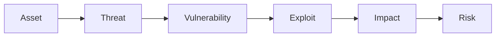
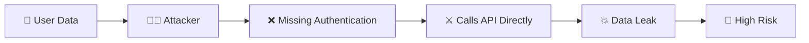

📂 **Module 1 - Security Fundamentals**

📄 **02 - Security Terminology.md**

---

# Security Terminology

> Before learning Web Application Security, you must understand the basic language used by every security engineer. These five terms appear in almost every interview, security report, and penetration test.

---

# Learning Objectives

After completing this chapter, you should be able to:

- Define Asset
- Define Threat
- Define Vulnerability
- Define Exploit
- Define Impact
- Define Risk
- Identify them in real-world scenarios
- Think like an Application Security Engineer

---

# The Security Chain

Every security problem follows the same chain.



Understanding this chain is one of the most important concepts in Application Security.

---

# 1. Asset

## Definition (Interview)

> An Asset is anything valuable that needs protection.

---

## Simple Explanation

If losing something would hurt you or your company, it is probably an asset.

---

## FitFlow Example

Assets include:

- MongoDB Database
- User Passwords
- JWT Tokens
- Cookies
- Source Code
- API Endpoints
- .env File
- MongoDB Connection String
- Workout Data
- User Profile Data

---

# 2. Threat

## Definition (Interview)

> A Threat is anything that has the potential to damage or compromise an asset.

---

## Simple Explanation

A threat is not the damage itself.

It is something capable of causing damage.

---

## Examples

Threats can be:

- Hacker
- Malicious User
- Malware
- Insider Employee
- Bot
- Natural Disaster
- Fire
- Stolen Laptop

---

## FitFlow Example

Asset

```
User Password
```

Threat

```
Attacker
```

The attacker has the potential to steal passwords.

---

# 3. Vulnerability

## Definition (Interview)

> A Vulnerability is a weakness that a threat can exploit.

---

## Simple Explanation

A vulnerability is the mistake.

It is the weak point.

Without a vulnerability, many attacks would fail.

---

## Examples

- Password stored in plain text
- Missing Authentication
- Missing Authorization
- SQL Injection
- Weak JWT Secret
- Exposed .env File
- Open S3 Bucket

---

## FitFlow Example

Suppose passwords are stored like this:

```
Password

aditya123
```

instead of

```
$2b$10$hj34......
```

This is a vulnerability.

---

# 4. Exploit

## Definition (Interview)

> An Exploit is the action of taking advantage of a vulnerability.

---

## Simple Explanation

The vulnerability already exists.

The exploit is when the attacker actually uses it.

---

## Example

Vulnerability

```
Passwords stored in plain text.
```

Exploit

Attacker accesses the database and reads every password.

---

Another Example

Vulnerability

```
No Authentication Middleware
```

Exploit

Attacker directly calls

```
GET /profile?id=123
```

and retrieves another user's profile.

---

# 5. Impact

## Definition (Interview)

> Impact is the damage caused after a successful exploit.

---

## Simple Explanation

Impact answers the question:

"What happened because the attack succeeded?"

---

## Examples

- User accounts stolen
- Money lost
- Database deleted
- Company reputation damaged
- Business downtime
- Customer trust lost

---

## FitFlow Example

Suppose passwords leak.

Impact:

- Users lose trust
- Password reuse attacks
- Reputation damage
- Legal consequences

---

# 6. Risk

## Definition (Interview)

> Risk is the likelihood that a threat will successfully exploit a vulnerability and the severity of the resulting impact.

---

## Simple Explanation

Risk combines two things.

```
Risk

=

Chance of attack

+

Damage caused
```

---

## Risk Formula

```
Risk

=

Likelihood × Impact
```

---

## Examples

### Example 1

Plain-text passwords

Likelihood

High

Impact

High

Risk

Very High

---

### Example 2

Weak password policy

Likelihood

Medium

Impact

Medium

Risk

Medium

---

### Example 3

Public admin API

Likelihood

Very High

Impact

Very High

Risk

Critical

---

# Complete Example

Imagine FitFlow stores passwords like this.

```
Password

aditya123
```

Let's identify everything.

---

## Asset

User Password

---

## Threat

Attacker

---

## Vulnerability

Password stored in plain text

---

## Exploit

Attacker gains database access and reads passwords

---

## Impact

- Accounts compromised
- User trust lost
- Reputation damage

---

## Risk

Very High

Because:

Likelihood = High

Impact = High

---

# Second Example

Suppose your API

```
GET /profile?id=123
```

returns user data without checking authentication.

---

## Asset

User Profile Data

---

## Threat

Unauthorized User

---

## Vulnerability

Missing Authentication Middleware

---

## Exploit

Attacker changes

```
?id=123
```

to

```
?id=124
```

and views another user's profile.

---

## Impact

- Privacy breach
- Customer trust lost
- Legal issues

---

## Risk

Critical

---

# Mermaid Diagram



---

# Common Mistakes

❌ Threat and Vulnerability are the same.

No.

Threat = Attacker

Vulnerability = Weakness

---

❌ Exploit and Vulnerability are the same.

No.

Vulnerability exists first.

Exploit is the attack.

---

❌ Risk means attack.

Wrong.

Risk is the probability and impact of an attack.

---

# Security Perspective

An Application Security Engineer never starts with:

"How do I stop hackers?"

Instead, they ask:

1. What assets do we have?
2. What threats exist?
3. What vulnerabilities exist?
4. How can someone exploit them?
5. What would be the impact?
6. Which risks should we fix first?

This structured thinking is used in threat modeling, code reviews, penetration testing, and secure design.

---

# Interview Questions

## Q1

What is the difference between a Threat and a Vulnerability?

Answer:

A threat is something capable of causing harm, while a vulnerability is the weakness that allows the threat to succeed.

---

## Q2

Can a threat exist without a vulnerability?

Yes.

For example, a hacker may try to attack your application, but if no exploitable vulnerability exists, the attack may fail.

---

## Q3

Can a vulnerability exist without a threat?

Yes.

A weakness may exist in the application even if no attacker has attempted to exploit it yet.

---

## Q4

What is Risk?

Risk is the combination of the likelihood of exploitation and the severity of the impact.

---

# Summary

- Asset → Something valuable.
- Threat → Something capable of causing harm.
- Vulnerability → Weakness.
- Exploit → Action that abuses the weakness.
- Impact → Damage caused.
- Risk → Likelihood × Impact.

Remember the chain:

```
Asset
   ↓
Threat
   ↓
Vulnerability
   ↓
Exploit
   ↓
Impact
   ↓
Risk
```

---

# Hands-on Exercise

Take your FitFlow project and identify **three security scenarios**.

For each scenario, write:

1. Asset
2. Threat
3. Vulnerability
4. Exploit
5. Impact
6. Risk

This exercise trains you to think like an Application Security Engineer instead of only a developer.


---