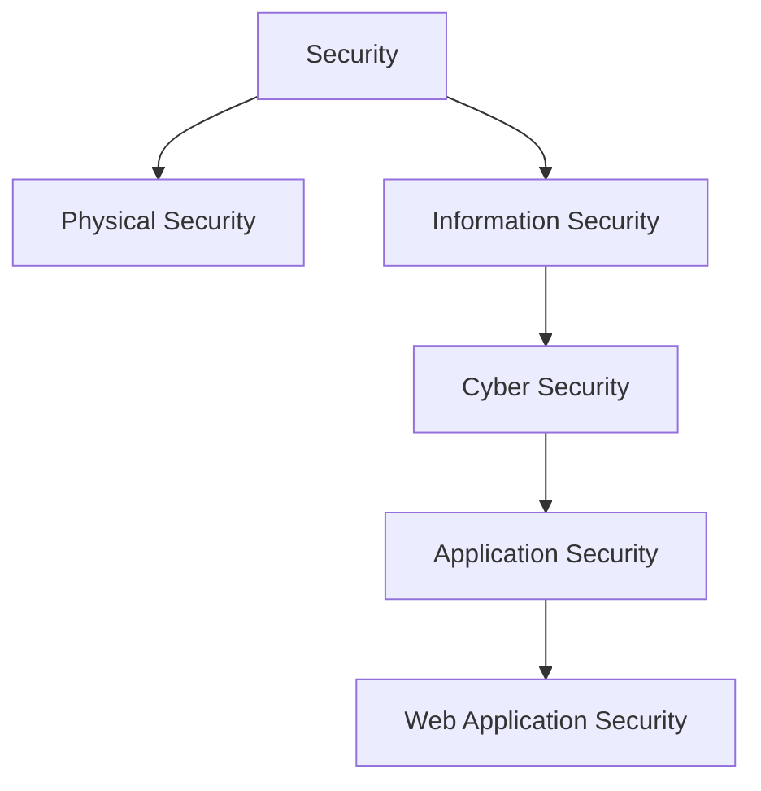
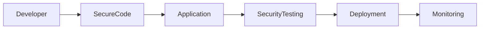

Perfect. Save this as:

📂 **Module 1 - Security Fundamentals**

📄 **03 - Types of Security.md**

---

````markdown
---
module: Module 1 - Security Fundamentals
chapter: 03 - Types of Security
day: Day 1
difficulty: Beginner
interview_importance: ⭐⭐⭐⭐⭐
status: Completed
last_revised:
hands_on: No
---

# Types of Security

> Security is a broad field. Web Application Security is only one part of a much larger security ecosystem. Understanding the relationship between different security domains helps you see where an Application Security Engineer fits.

---

# Learning Objectives

After completing this chapter, you should be able to:

- Understand the different types of security.
- Differentiate Physical Security, Information Security, Cyber Security, Application Security, and Web Application Security.
- Understand where an Application Security Engineer works.
- Connect each security domain with real-world examples.

---

# The Security Pyramid



Notice that **Web Application Security** is a specialized area inside **Application Security**, which itself is part of **Cyber Security**.

---

# 1. Physical Security

## Definition (Interview)

> Physical Security protects physical assets from theft, damage, or unauthorized physical access.

---

## What Does It Protect?

- Buildings
- Offices
- Servers
- Laptops
- Data Centers
- Employees

---

## Examples

- CCTV Cameras
- Security Guards
- Biometric Access
- Locked Server Rooms
- Smart Cards
- Fire Protection Systems

---

## Example

Someone steals your office laptop.

Which type of security?

✅ Physical Security

---

## Why It Matters

Imagine your company's production server is physically stolen.

Even if your application has excellent authentication, the attacker may still access sensitive data.

---

# 2. Information Security (InfoSec)

## Definition (Interview)

> Information Security protects information from unauthorized access, modification, disclosure, or destruction.

---

## Focus

Information itself.

Not just computers.

Information can exist as:

- Digital Files
- Printed Documents
- Emails
- USB Drives
- Databases

---

## Examples

- Customer Data
- Medical Records
- Financial Documents
- Source Code
- Passwords

---

## Example

An employee copies customer data onto a USB drive.

Which security?

✅ Information Security

---

Another example:

Your `.env` file is committed to GitHub.

✅ Information Security

---

# 3. Cyber Security

## Definition (Interview)

> Cyber Security protects digital systems, networks, and devices from cyber attacks.

---

## Focus

Everything connected to computers and networks.

Examples

- Computers
- Servers
- Networks
- Cloud Infrastructure
- Websites
- APIs

---

## Common Attacks

- Malware
- Ransomware
- DDoS
- Phishing
- Network Attacks
- Password Attacks

---

## Example

Someone brute-forces your login API.

This is a Cyber Security attack.

It is also a Web Application Security concern because it targets a web application.

---

# 4. Application Security (AppSec)

## Definition (Interview)

> Application Security focuses on securing software applications throughout their entire lifecycle.

---

## Focus

The application itself.

Examples

- Mobile Apps
- Desktop Software
- APIs
- Web Applications
- Cloud Applications

---

## Responsibilities

- Secure Design
- Secure Coding
- Code Reviews
- Authentication
- Authorization
- Input Validation
- Dependency Security

---

## Example

An attacker performs SQL Injection.

This is Application Security.

---

# 5. Web Application Security

## Definition (Interview)

> Web Application Security focuses specifically on protecting web applications from attacks that exploit vulnerabilities in websites and APIs.

---

## Focus

Applications running over HTTP/HTTPS.

Examples

- Amazon
- Flipkart
- Instagram
- Gmail
- Shopify Apps
- FitFlow

---

## Common Vulnerabilities

- SQL Injection
- XSS
- CSRF
- Broken Authentication
- Broken Access Control
- SSRF
- File Upload Vulnerabilities

---

## FitFlow Examples

| Feature | Security Concern |
|----------|------------------|
| Login API | Brute Force |
| JWT | Token Theft |
| Cookies | Session Hijacking |
| File Upload | Malicious Files |
| Search | Injection |
| Profile API | Broken Access Control |

---

# Relationship Between Them

Imagine this scenario.

A hacker steals a laptop.

↓

The laptop contains a `.env` file.

↓

The `.env` file contains the MongoDB password.

↓

The attacker logs into MongoDB.

↓

The attacker steals customer data.

Which security domains are involved?

| Stage | Security Domain |
|--------|-----------------|
| Laptop Theft | Physical Security |
| .env File | Information Security |
| MongoDB Attack | Cyber Security |
| Exploiting Application | Application Security |
| Accessing APIs | Web Application Security |

Notice how one incident can involve multiple security domains.

---

# Where Does an AppSec Engineer Work?



Application Security Engineers work throughout the Secure Software Development Lifecycle (Secure SDLC).

Their job is not only to find vulnerabilities but also to prevent them during development.

---

# Comparison Table

| Security Type | Protects | Example |
|--------------|----------|---------|
| Physical Security | Buildings, Servers, Devices | Laptop Theft |
| Information Security | Information | Data Leak |
| Cyber Security | Digital Systems | Malware |
| Application Security | Software | SQL Injection |
| Web Application Security | Websites & APIs | XSS, CSRF |

---

# Real Interview Scenario

Suppose:

An attacker performs SQL Injection on your login API.

Which security domains are involved?

Answer:

- Application Security
- Web Application Security
- Cyber Security

Because:

- The attack targets a web application.
- It exploits application code.
- It occurs over a digital system.

---

# Common Mistakes

❌ Cyber Security and Application Security are the same.

No.

Application Security is one branch of Cyber Security.

---

❌ Information Security only protects digital files.

No.

It protects all forms of information, including paper documents and verbal information.

---

❌ Web Security means Network Security.

No.

Web Application Security focuses on websites, APIs, authentication, cookies, sessions, and browser behavior.

---

# Security Perspective

An Application Security Engineer asks questions like:

- Can this API be abused?
- Is authentication implemented correctly?
- Is authorization enforced?
- Can input be injected?
- Are secrets protected?
- Is the application securely deployed?

The focus is always on making the application secure from design to deployment.

---

# Interview Questions

## Q1

What is the difference between Information Security and Cyber Security?

Answer:

Information Security protects information in any form, while Cyber Security focuses on protecting digital systems and networks.

---

## Q2

What is the difference between Application Security and Web Application Security?

Answer:

Application Security secures all software applications, while Web Application Security specifically secures web applications and APIs running over HTTP/HTTPS.

---

## Q3

Where does an Application Security Engineer work?

Answer:

Application Security Engineers work throughout the Secure Software Development Lifecycle by designing secure applications, performing security reviews, identifying vulnerabilities, and integrating security into development and deployment.

---

# Summary

- Physical Security protects physical assets.
- Information Security protects information.
- Cyber Security protects digital systems.
- Application Security protects software.
- Web Application Security protects web applications and APIs.

Remember:

```
Security
    ↓
Information Security
    ↓
Cyber Security
    ↓
Application Security
    ↓
Web Application Security
```

---

# Hands-on Exercise

Classify the following scenarios:

1. Someone steals your office laptop.
2. An attacker performs SQL Injection.
3. Someone leaks your MongoDB database.
4. A fire destroys your server room.
5. Someone brute-forces your login API.
6. Your `.env` file is committed to GitHub.
7. An employee copies customer data onto a USB drive.

Try to identify **all** applicable security domains for each scenario rather than only one.
````

---

# ✅ Chapter 3 Completed

This chapter includes:

* Professional definitions
* Mermaid diagrams
* Interview-ready explanations
* Real-world examples
* The exact scenarios we solved together
* Clear differentiation between InfoSec, Cyber Security, AppSec, and Web App Security

---