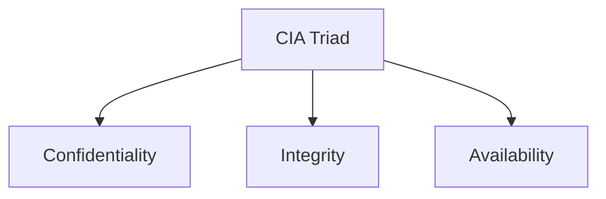
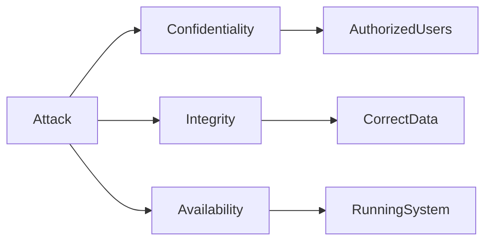

Perfect. This completes **Module 1**. Save this as:

📂 **Module 1 - Security Fundamentals**

📄 **04 - CIA Triad.md**

---

````markdown
---
module: Module 1 - Security Fundamentals
chapter: 04 - CIA Triad
day: Day 1
difficulty: Beginner
interview_importance: ⭐⭐⭐⭐⭐
status: Completed
last_revised:
hands_on: Yes
---

# CIA Triad

> "The CIA Triad is the foundation of Information Security. Every security control, vulnerability, and attack can be analyzed from the perspective of Confidentiality, Integrity, and Availability."

---

# Learning Objectives

After completing this chapter, you should be able to:

- Define the CIA Triad.
- Explain Confidentiality, Integrity, and Availability.
- Identify which security property is affected during an attack.
- Analyze your own applications using the CIA model.
- Think like an Application Security Engineer.

---

# What is the CIA Triad?

## Interview Definition

> The CIA Triad is a security model consisting of **Confidentiality, Integrity, and Availability**. It is used to design, evaluate, and improve the security of systems and applications.

---

# Why was the CIA Triad Introduced?

Imagine you build a web application.

Question:

How do you know if it is secure?

Should we only protect passwords?

Should we only encrypt data?

Should we only stop hackers?

Security needed a simple framework.

The answer became...

```
CIA

↓

Confidentiality

Integrity

Availability
```

Every security problem can be analyzed using these three principles.

---

# CIA Overview



---

# 1. Confidentiality

## Definition

> Confidentiality ensures that information is accessible **only to authorized users**.

---

## Simple Meaning

The wrong person should **never** see sensitive information.

---

## Examples

- Passwords
- Medical Records
- Bank Accounts
- JWT Tokens
- Cookies
- Source Code

---

## FitFlow Example

User A logs in.

User A should only see:

```
Profile

Exercises

Workout History
```

belonging to User A.

If User A can view User B's profile...

Confidentiality is broken.

---

## Common Attacks

- Data Leaks
- Broken Access Control
- SQL Injection
- IDOR
- Password Theft

---

## How We Protect Confidentiality

- Authentication
- Authorization
- Encryption
- Access Control
- HTTPS
- JWT
- Secure Cookies

---

# 2. Integrity

## Definition

> Integrity ensures that data remains accurate, complete, and cannot be modified without authorization.

---

## Simple Meaning

Data should not change unless an authorized user changes it.

---

## Examples

Suppose your salary is

```
₹50,000
```

An attacker changes it to

```
₹5,00,000
```

The data is still available.

But...

It is no longer correct.

Integrity is broken.

---

## FitFlow Example

Workout History

```
Bench Press

80kg
```

Attacker changes it to

```
800kg
```

The data exists.

But it is wrong.

Integrity has been violated.

---

## Common Attacks

- SQL Injection
- Unauthorized API Access
- Parameter Tampering
- Database Modification

---

## How We Protect Integrity

- Authorization
- Input Validation
- Digital Signatures
- Checksums
- Database Constraints
- Hashing

---

# 3. Availability

## Definition

> Availability ensures that systems and information remain accessible whenever authorized users need them.

---

## Simple Meaning

The application should be available when users want to use it.

---

## Examples

Suppose Instagram servers crash.

Nobody can login.

Nobody can upload photos.

No data leaked.

No data changed.

Still...

Availability is broken.

---

## FitFlow Example

Server crashes.

Users cannot:

- Login
- View Workouts
- Save Exercises

Availability is lost.

---

## Common Causes

- DDoS
- Server Crash
- Power Failure
- Hardware Failure
- Cloud Outage

---

## How We Protect Availability

- Backups
- Load Balancers
- Auto Scaling
- Redundant Servers
- Monitoring
- Disaster Recovery

---

# CIA Using FitFlow

Imagine these situations.

---

## Scenario 1

Attacker steals JWT Token.

Which principle?

```
Confidentiality
```

Because someone unauthorized can access user data.

---

## Scenario 2

Attacker changes another user's workout history.

```
Integrity
```

---

## Scenario 3

MongoDB server crashes.

```
Availability
```

---

## Scenario 4

An attacker downloads every user's password.

```
Confidentiality
```

---

## Scenario 5

Attacker deletes the entire database.

Which principles are affected?

```
Integrity

Availability
```

Data has been modified (deleted), and users can no longer access it.

---

# FitFlow Asset Analysis

| Asset | C | I | A |
|--------|:-:|:-:|:-:|
| User Passwords | ✅ | ✅ | ❌ |
| JWT Tokens | ✅ | ✅ | ❌ |
| Workout Data | ✅ | ✅ | ✅ |
| MongoDB Database | ✅ | ✅ | ✅ |
| Source Code | ✅ | ✅ | ❌ |
| Authentication System | ✅ | ✅ | ✅ |
| API Endpoints | ❌ | ✅ | ✅ |

---

# How an AppSec Engineer Uses CIA

Suppose a new feature is added.

```
POST /upload-profile-photo
```

Instead of immediately reviewing code, an AppSec Engineer asks:

### Confidentiality

Can another user view private images?

---

### Integrity

Can someone replace another user's photo?

---

### Availability

Can someone upload huge files and crash the server?

---

Notice...

CIA becomes a checklist for security thinking.

---

# Mermaid Diagram



---

# Real Interview Scenario

Interviewer asks:

Suppose an attacker changes another user's email address.

Which principle is violated?

Answer:

```
Integrity
```

---

Suppose an attacker downloads the customer database.

Answer:

```
Confidentiality
```

---

Suppose the server crashes for two hours.

Answer:

```
Availability
```

---

Suppose an attacker deletes the database.

Answer:

```
Integrity

+

Availability
```

---

# Common Mistakes

❌ Confidentiality means Encryption.

No.

Encryption is one method of protecting Confidentiality.

---

❌ Availability means server uptime only.

No.

Anything preventing authorized users from using the system affects Availability.

---

❌ Integrity means database consistency only.

No.

Integrity applies to every type of data.

---

# Security Perspective

Whenever you discover a vulnerability, ask:

```
Does this affect

Confidentiality?

Integrity?

Availability?
```

Sometimes more than one principle is affected.

Example:

SQL Injection.

May affect:

- Confidentiality
- Integrity
- Availability

all at once.

---

# Interview Questions

## Q1

What is CIA?

Answer:

Confidentiality, Integrity, Availability.

---

## Q2

Someone steals user passwords.

Which principle?

Confidentiality.

---

## Q3

Someone changes user passwords.

Which principle?

Integrity.

---

## Q4

Database server crashes.

Which principle?

Availability.

---

## Q5

Can one attack affect multiple principles?

Yes.

Example:

SQL Injection can affect all three.

---

# Summary

Confidentiality

↓

Prevent unauthorized access.

---

Integrity

↓

Prevent unauthorized modification.

---

Availability

↓

Ensure systems remain accessible.

Remember:

```
Can someone SEE it?

↓

Confidentiality

----------------

Can someone CHANGE it?

↓

Integrity

----------------

Can someone USE it?

↓

Availability
```

---

# Hands-on Exercise

Take your FitFlow project and list **10 assets**.

For each asset, identify:

| Asset | Confidentiality | Integrity | Availability |
|--------|-----------------|-----------|--------------|

Example:

| JWT Token | ✅ | ✅ | ❌ |
| Workout History | ✅ | ✅ | ✅ |
| MongoDB | ✅ | ✅ | ✅ |

Think like an Application Security Engineer and explain **why** each property matters for that asset.
````

---

# 🎉 Module 1 Completed

Congratulations! You have now completed the **Security Fundamentals** module.

### ✅ What You Can Now Explain in an Interview

* What is Security?
* Why Security is Important
* Assets
* Threats
* Vulnerabilities
* Exploits
* Impact
* Risk
* Physical Security
* Information Security
* Cyber Security
* Application Security
* Web Application Security
* CIA Triad
* Real-world examples using your **FitFlow** project

---