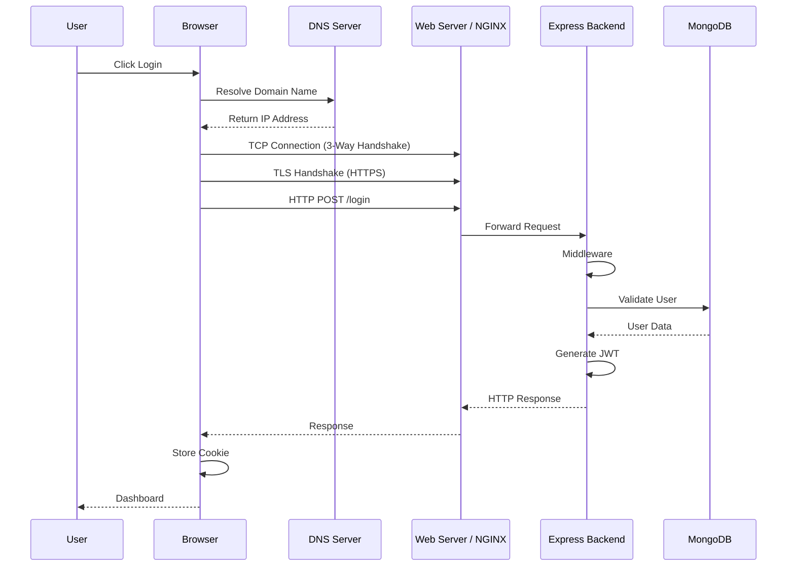
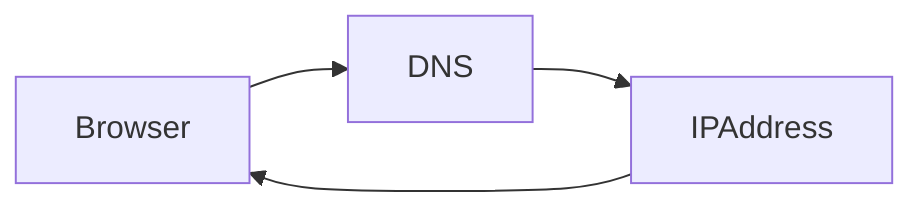
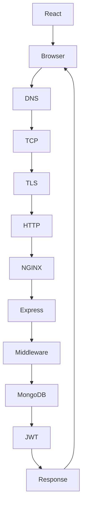

```
📂 Module 2 - Web Communication & Browser Security Foundations

📄 01 - Journey of a Request.md
```

---

# Journey of a Request

> Before learning Web Application Security, you must understand how a request travels from the user's browser to your backend server. Every security mechanism exists somewhere along this journey.

---

# Learning Objectives

After completing this chapter, you should be able to:

- Explain the complete request lifecycle.
- Understand Browser → Server communication.
- Explain where DNS, TCP, TLS and HTTP fit.
- Understand where AppSec controls exist.
- Connect the journey with your own FitFlow application.

---

# Why Learn This?

Imagine an interviewer asks:

> Explain what happens after a user clicks the Login button.

If you answer only:

```
React calls Express.
```

❌ Wrong.

The browser performs many networking steps before your Express backend even receives the request.

Understanding this flow is one of the strongest foundations for Web Application Security.

---

# Complete Request Journey



---

# Step 1 — User Action

Everything begins with a user action.

Examples

- Clicking Login
- Opening Profile
- Uploading a File
- Refreshing a Page

Example

```
User clicks Login
```

---

# Step 2 — React

Your Login Component executes

```javascript
axios.post("/login",data,{
    withCredentials:true
})
```

Important:

React does NOT communicate directly with Express.

React asks the Browser to send an HTTP request.

---

## Developer Note

Many developers think:

```
React

↓

Express
```

Actually it is:

```
React

↓

Browser

↓

Internet

↓

Express
```

---

# Step 3 — Browser

The browser prepares the HTTP request.

It decides:

- URL
- Method
- Headers
- Cookies
- Request Body

If cookies exist for that domain,

the browser automatically attaches them.

---

## Security Perspective

The browser is responsible for enforcing:

- Same-Origin Policy
- Cookie Rules
- HttpOnly
- Secure
- SameSite
- CORS Restrictions

The browser is your first security layer.

---

# Step 4 — DNS Resolution

The browser only knows:

```
https://fitflow.com
```

Computers cannot communicate using domain names.

They need IP addresses.

The browser asks:

```
DNS

↓

What is the IP address of fitflow.com?
```

DNS replies

```
103.42.xx.xx
```

Now the browser knows where to connect.

---

## Mermaid



---

# Step 5 — TCP Connection

The browser now knows the server IP.

Before sending HTTP,

it must establish a reliable connection.

TCP performs

```
Three-Way Handshake
```

```
SYN

↓

SYN ACK

↓

ACK
```

After this,

both machines trust the connection exists.

---

## Why TCP?

Because HTTP needs reliable communication.

No missing packets.

No incorrect ordering.

---

# Step 6 — TLS Handshake

If using HTTPS

(which almost every website does)

the browser performs

TLS Handshake.

Purpose

- Encrypt communication
- Verify server identity
- Prevent eavesdropping

Without TLS

your passwords travel as plain text.

---

## Security Perspective

TLS protects

```
Browser

↓

Internet

↓

Server
```

It does NOT protect data already stored in MongoDB.

---

# Step 7 — HTTP Request

Now the browser sends

```
POST /login
```

This request contains

- Request Line
- Headers
- Body

Example

```http
POST /login HTTP/1.1

Host: api.fitflow.com

Content-Type: application/json

{
   "email":"aditya@gmail.com",
   "password":"********"
}
```

---

# Step 8 — Reverse Proxy (NGINX)

Many production applications use

```
NGINX
```

Responsibilities

- SSL Termination
- Load Balancing
- Reverse Proxy
- Static File Serving
- Request Routing

Request Flow

```
Browser

↓

NGINX

↓

Express
```

---

# Step 9 — Express Backend

Express receives the request.

Example

```javascript
app.post("/login",loginController)
```

Express itself doesn't authenticate users.

It only routes the request.

---

# Step 10 — Middleware

Before reaching the controller

middleware may execute.

Examples

```javascript
helmet()

cookieParser()

cors()

verifyJWT()

rateLimiter()
```

Middleware can

- Block requests
- Modify requests
- Authenticate users
- Log requests

---

## Security Perspective

Most security controls begin here.

Examples

- Authentication
- Authorization
- Rate Limiting
- Input Validation

---

# Step 11 — MongoDB

Express queries MongoDB.

Example

```javascript
User.findOne({
    email
})
```

MongoDB returns

User Data.

---

# Step 12 — JWT Generation

After successful authentication

Express generates

```
JWT
```

This token identifies the user.

---

# Step 13 — Response

Express creates

HTTP Response

Example

```http
HTTP/1.1 200 OK

Set-Cookie:

accessToken=...

{
   "success":true
}
```

Notice

Server sends

```
Set-Cookie
```

NOT

```
Cookie
```

---

# Step 14 — Browser Stores Cookie

The browser receives

```
Set-Cookie
```

Stores it.

Later

automatically sends

```
Cookie
```

This behaviour is handled entirely by the browser.

---

# Complete FitFlow Flow



---

# Common Mistakes

❌ React talks directly to Express.

Wrong.

The Browser performs networking.

---

❌ HTTP creates the TCP connection.

Wrong.

TCP exists before HTTP.

---

❌ TLS encrypts MongoDB.

Wrong.

TLS encrypts communication.

---

❌ Express automatically authenticates users.

Wrong.

Authentication is implemented by developers using middleware.

---

# Security Notes

Attack Surface

Browser

↓

DNS

↓

TCP

↓

TLS

↓

HTTP

↓

Express

↓

Middleware

↓

Database

Every layer can have vulnerabilities.

Application Security focuses mostly on

- HTTP
- Authentication
- Authorization
- Cookies
- APIs
- Business Logic

---

# Interview Questions

## Q1

Explain what happens after clicking Login.

(Explain the complete request journey.)

---

## Q2

Why is DNS required?

Because computers communicate using IP addresses, not domain names.

---

## Q3

Does HTTP create a connection?

No.

TCP creates the connection.

HTTP uses it.

---

## Q4

Where is authentication usually performed?

In backend middleware or controllers after the HTTP request reaches the application.

---

# Revision Summary

✔ User clicks Login

↓

✔ React calls Browser

↓

✔ Browser resolves DNS

↓

✔ TCP Connection

↓

✔ TLS Handshake

↓

✔ HTTP Request

↓

✔ Reverse Proxy

↓

✔ Express

↓

✔ Middleware

↓

✔ MongoDB

↓

✔ JWT

↓

✔ HTTP Response

↓

✔ Browser stores Cookie

---

# Hands-on

Open Chrome DevTools.

Go to

```
F12

↓

Network

↓

Login Request
```

Identify

- Request URL
- Method
- Headers
- Request Body
- Response Headers
- Set-Cookie
- Status Code

This exercise connects theory with real browser behavior.

---
