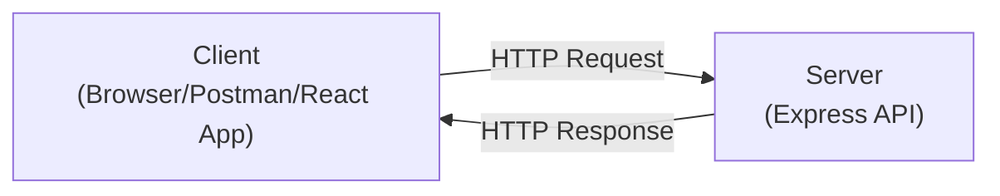
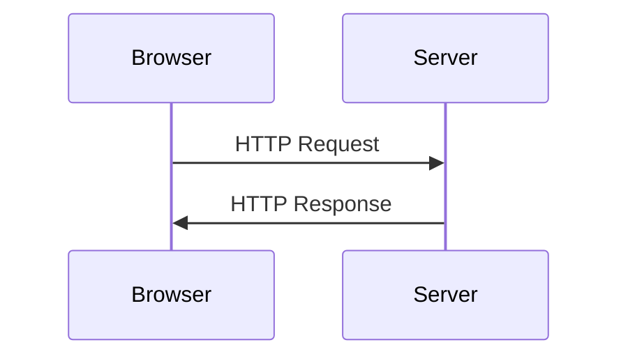
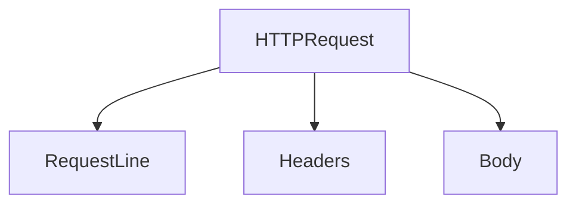
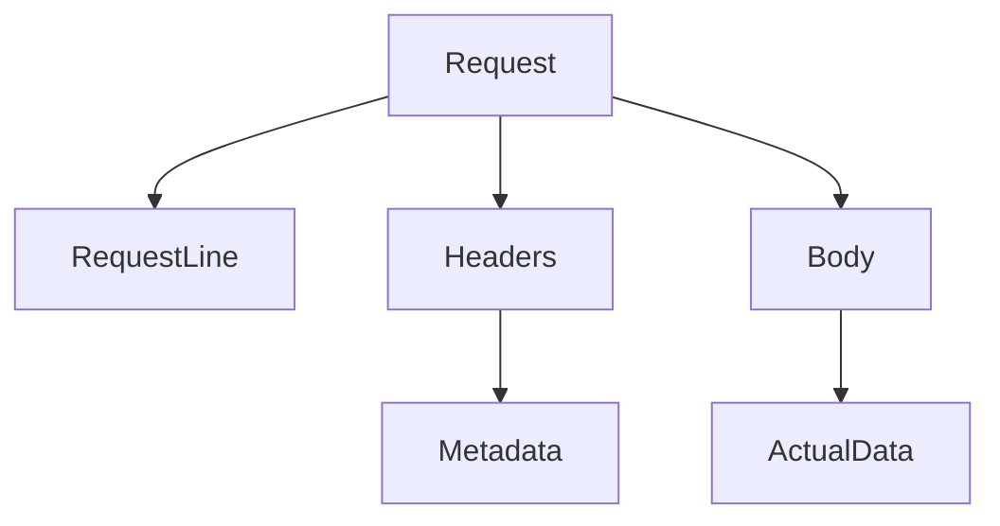
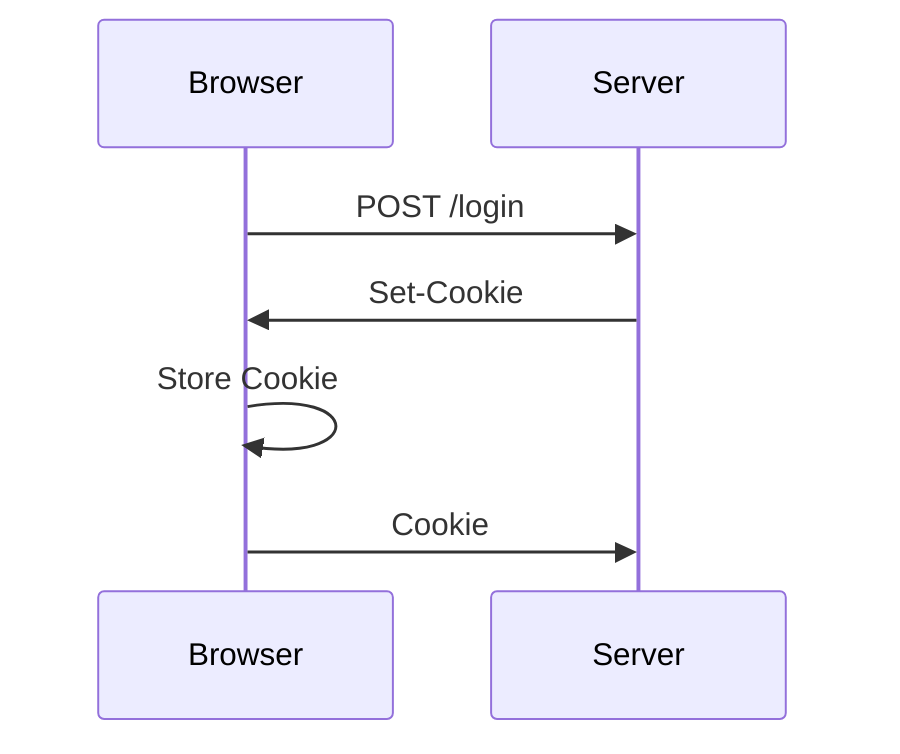
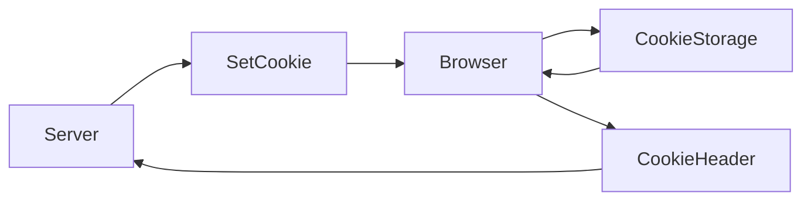
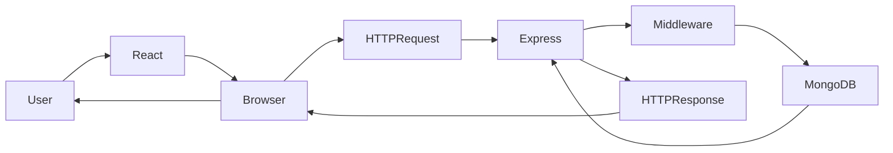

---

module: Module 2 - Web Communication & Browser Security Foundations
chapter: 02 - HTTP Deep Dive
day: Day 2
difficulty: Beginner
interview_importance: ⭐⭐⭐⭐⭐
status: Completed
last_revised:
hands_on: Yes
-------------

# HTTP Deep Dive

> **HTTP (HyperText Transfer Protocol)** is the communication protocol that allows clients (browsers, mobile apps, Postman, etc.) to communicate with servers over the Web.

---

# Learning Objectives

After completing this chapter you should be able to:

* Explain HTTP from scratch.
* Understand the Request-Response model.
* Differentiate Client and Server.
* Read any HTTP Request.
* Read any HTTP Response.
* Understand HTTP Headers.
* Understand Request Body and Response Body.
* Explain HTTP in interviews.
* Connect HTTP with Express, React and FitFlow.

---

# What is HTTP?

## Interview Definition

> **HTTP (HyperText Transfer Protocol)** is an application-layer protocol used for communication between a client and a server.

---

## Simple Definition

Imagine you call a restaurant.

```
You

↓

"One Pizza Please"

↓

Restaurant

↓

"Pizza is Ready"
```

This conversation follows certain rules.

Similarly,

A Browser and a Server communicate using a set of rules.

Those rules are called **HTTP**.

---

# Why was HTTP Introduced?

Computers already knew how to communicate using TCP.

But TCP only provides a reliable connection.

It does **not** define:

* What resource is requested?
* What operation should be performed?
* What data is being sent?
* How should the server respond?

HTTP provides these rules.

Without HTTP, the server would receive raw bytes and have no idea whether the client wanted to:

* Login
* Download an image
* Delete a user
* Upload a file

HTTP standardizes communication.

---

# Where Does HTTP Work?

Remember the TCP/IP stack.

```text
Application Layer
    ↑
    HTTP

Transport Layer
    ↑
    TCP

Network Layer
    ↑
    IP

Data Link Layer

Physical Layer
```

HTTP works **above TCP**.

HTTP depends on TCP for reliable communication.

---

# Client and Server

Every HTTP communication has two participants.



---

## Client

The client is the application that **initiates** communication.

Examples

* Chrome
* Firefox
* Edge
* Mobile App
* React Application
* Postman
* curl

The client asks for resources.

---

## Server

The server receives requests and returns responses.

Examples

* Express
* Spring Boot
* Django
* ASP.NET
* Laravel
* Nginx (can also proxy requests)

The server provides resources.

---

# Request-Response Model

HTTP is based on a simple model.



Every request receives one response.

Example

```
GET /profile

↓

HTTP Response

200 OK
```

---

# Real FitFlow Example

When a user logs in:

```javascript
axios.post("/login",{
    email,
    password
},{
    withCredentials:true
});
```

React does **not** talk directly to Express.

The browser creates an HTTP request.

```
Browser

↓

HTTP Request

↓

Express Server

↓

HTTP Response

↓

Browser
```

---

# HTTP is Stateless

One of the most important interview questions.

HTTP is a **stateless protocol**.

Meaning:

The server **does not remember previous requests**.

Example

Request 1

```
GET /profile
```

Server processes it.

Finished.

---

Request 2

```
GET /exercise
```

Server treats it like a completely new request.

It does **not** remember that the same user made Request 1.

---

## Why is this a Problem?

Imagine Gmail.

Request 1

```
POST /login
```

Server authenticates you.

---

Request 2

```
GET /inbox
```

How does the server know that you're already logged in?

HTTP itself provides **no memory**.

This problem is solved using:

* Cookies
* Sessions
* JWT

We'll study these in later chapters.

---

# HTTP Communication Flow

```mermaid
flowchart LR

User

↓

Browser

↓

HTTP Request

↓

Express Server

↓

Business Logic

↓

Database

↓

HTTP Response

↓

Browser

↓

User
```

---

# Anatomy of an HTTP Request

Every HTTP request consists of three major parts.



---

# Part 1 - Request Line

The first line tells the server:

* What action?
* Which resource?
* Which HTTP version?

Example

```http
POST /login HTTP/1.1
```

It has three components.

```
POST

/login

HTTP/1.1
```

---

## HTTP Method

Tells the server **what you want to do**.

Examples

```
GET

POST

PUT

PATCH

DELETE
```

We'll study each method later in this chapter.

---

## URL / Path

Specifies the resource.

Examples

```
/login

/profile

/exercises

/api/users
```

---

## HTTP Version

Examples

```
HTTP/1.1

HTTP/2

HTTP/3
```

Different versions improve performance but keep the same overall communication model.

---

# Complete Request Example

```http
POST /login HTTP/1.1
Host: api.fitflow.com
Content-Type: application/json
Content-Length: 58

{
    "email":"aditya@gmail.com",
    "password":"password123"
}
```

Notice that the request is divided into:

1. Request Line
2. Headers
3. Blank Line
4. Body

---

# Security Perspective

As an Application Security Engineer, when an HTTP request arrives you immediately think:

* Is the correct HTTP method used?
* Can this endpoint be abused?
* Is authentication required?
* Are headers valid?
* Is user input validated?
* Can this body contain malicious payloads?

Instead of only asking **"Does it work?"**, you ask **"How can this request be abused?"**

---

# Common Mistakes

❌ HTTP and HTTPS are the same.

HTTPS = HTTP + TLS Encryption.

---

❌ React communicates directly with Express.

React asks the browser.

The browser sends HTTP.

---

❌ TCP and HTTP are the same.

TCP creates a reliable connection.

HTTP defines how web communication happens.

---

# Interview Questions

### Q1. What is HTTP?

**Answer:**

HTTP is an application-layer protocol that defines how clients and servers communicate over the Web.

---

### Q2. Is HTTP stateful?

No.

HTTP is stateless.

---

### Q3. What are the three major parts of an HTTP request?

* Request Line
* Headers
* Body

---

### Q4. What is contained in the Request Line?

* HTTP Method
* Request Path
* HTTP Version

---

# Revision Summary

✔ HTTP is an Application Layer Protocol.

✔ HTTP works on top of TCP.

✔ Browser sends HTTP Requests.

✔ Server returns HTTP Responses.

✔ HTTP is Stateless.

✔ Every Request has:

* Request Line
* Headers
* Body

---

## Next Part

The next section of this chapter covers:

* HTTP Headers
* Request Headers
* Response Headers
* Cookie vs Set-Cookie
* Request Body
* Response Body
* Browser Internals
* Chrome DevTools View
* Express Examples


# HTTP Headers

So far, we have learned that every HTTP request contains:

```text
Request Line
↓

Headers
↓

Body
```

Now we will study the **most important part** of HTTP communication.

Almost every Web Security topic—

* Authentication
* Cookies
* CORS
* CSP
* CSRF
* JWT
* API Security

depends on understanding HTTP Headers.

---

# What are HTTP Headers?

## Interview Definition

> **HTTP Headers are key-value pairs that provide additional information about an HTTP request or response.**

Headers are called **metadata**.

Metadata means:

> **Data about data.**

---

Imagine you order a parcel.

The box contains:

```
Laptop
```

But outside the box is information like:

```
From

To

Weight

Priority

Fragile
```

Those labels are **metadata**.

Similarly,

The HTTP Body contains the actual data,

while

Headers describe that data.

---

# Request Structure



---

# Example HTTP Request

```http
POST /login HTTP/1.1

Host: api.fitflow.com

Content-Type: application/json

Content-Length: 58

User-Agent: Chrome

Accept: application/json

{
   "email":"aditya@gmail.com",
   "password":"password123"
}
```

Notice

The body contains

```json
{
   "email":"aditya@gmail.com",
   "password":"password123"
}
```

Everything above it is metadata.

---

# Request Headers vs Response Headers

This is one of the most common interview questions.

```mermaid
sequenceDiagram

Browser->>Server: HTTP Request
Note Right of Browser:
Request Headers

Server->>Browser: HTTP Response
Note Left of Server:
Response Headers
```

Remember:

```
Browser

↓

Request Headers

----------------------

Server

↓

Response Headers
```

---

# Common Request Headers

## Host

Example

```http
Host: api.fitflow.com
```

Purpose

Tells the server which host the browser wants to communicate with.

Useful when one server hosts multiple websites.

---

## User-Agent

Example

```http
User-Agent: Chrome
```

Purpose

Identifies the client.

Example

* Chrome
* Firefox
* Edge
* Mobile Browser

Servers sometimes change responses depending on the browser.

---

## Accept

Example

```http
Accept: application/json
```

Meaning

"I can understand JSON."

Another example

```http
Accept: text/html
```

"I want HTML."

---

## Content-Type

One of the most important headers.

Example

```http
Content-Type: application/json
```

Meaning

"The request body contains JSON."

Other examples

```text
application/json

multipart/form-data

text/plain

application/xml
```

Without this header,

the server may not know how to parse the request body.

---

## Authorization

Example

```http
Authorization: Bearer eyJhbGc...
```

Purpose

Sends credentials.

Mostly used for

* JWT
* OAuth
* API Tokens

Notice

Authorization is **not** a cookie.

It is simply another HTTP header.

---

## Cookie

We'll study cookies deeply later.

For now remember

Browser sends

```http
Cookie:
accessToken=abc123
```

Cookie is a **Request Header**.

Browser automatically adds it.

JavaScript usually doesn't.

---

# Common Response Headers

The server also sends metadata.

Example

```http
HTTP/1.1 200 OK

Content-Type: application/json

Content-Length: 130

Set-Cookie: accessToken=abc123

Server: nginx
```

---

## Content-Type

Response example

```http
Content-Type: application/json
```

Meaning

"The response body contains JSON."

---

## Content-Length

Example

```http
Content-Length: 320
```

Meaning

How many bytes are in the response.

---

## Server

Example

```http
Server: nginx
```

Sometimes reveals which web server handled the request.

Many companies hide this header for security reasons.

---

## Set-Cookie

One of the most important headers.

Example

```http
Set-Cookie:
accessToken=abc123;
HttpOnly;
Secure;
SameSite=Strict
```

This tells the browser:

> "Store this cookie."

Notice carefully.

The browser NEVER sends

```
Set-Cookie
```

Only the server sends it.

---

# Cookie vs Set-Cookie

This confused almost every beginner.

Now you understand the difference.

| Header     | Sent By | Purpose                                 |
| ---------- | ------- | --------------------------------------- |
| Cookie     | Browser | Sends stored cookies back to the server |
| Set-Cookie | Server  | Asks the browser to store a cookie      |

---

## Complete Flow



Remember

Server

```
Set-Cookie
```

Browser

```
Cookie
```

---

# Browser Internals

When the browser receives

```http
Set-Cookie:
accessToken=abc123
```

It does NOT immediately send it back.

Instead,

the browser stores it internally.



The browser decides:

* Which cookie belongs to which domain.
* When to send it.
* Whether JavaScript can access it.
* Whether Secure, HttpOnly and SameSite rules apply.

---

# Developer Note

React usually **does not manually attach cookies**.

Example

```javascript
axios.get("/profile",{
    withCredentials:true
});
```

The browser checks its cookie storage.

If a matching cookie exists,

it automatically creates

```http
Cookie:
accessToken=abc123
```

before sending the request.

---

# Security Perspective

An Application Security Engineer inspects headers first.

Questions include:

* Is Authorization missing?
* Is Cookie present?
* Is Content-Type correct?
* Is Set-Cookie using HttpOnly?
* Is Secure enabled?
* Is SameSite configured?

Many vulnerabilities can be spotted simply by inspecting HTTP headers.

---

# Chrome DevTools

Open

```
F12

↓

Network

↓

Click Login Request

↓

Headers
```

Observe:

Request Headers

* Host
* Cookie
* Content-Type
* User-Agent
* Authorization (if used)

Response Headers

* Content-Type
* Set-Cookie
* Server
* Content-Length

This is one of the best ways to understand HTTP in practice.

---

# Common Mistakes

❌ Cookie and Set-Cookie are the same.

No.

Server sends Set-Cookie.

Browser sends Cookie.

---

❌ Headers contain application data.

Usually no.

Headers contain metadata.

The body contains the actual payload.

---

❌ Authorization and Cookie are identical.

No.

Both carry credentials, but they are different mechanisms.

---

# Interview Questions

### Q1. What are HTTP Headers?

Headers are metadata that provide additional information about a request or response.

---

### Q2. What is the difference between Cookie and Set-Cookie?

Set-Cookie is sent by the server to instruct the browser to store a cookie.

Cookie is sent by the browser in future requests.

---

### Q3. Why is Content-Type important?

It tells the receiver how to interpret the body.

---

### Q4. Does React automatically send cookies?

No.

The browser automatically sends matching cookies.

---

# HTTP Body

So far we have learned:

```
HTTP Request

↓

Request Line

↓

Headers

↓

Body
```

The **Body** contains the **actual data** that the client wants to send to the server or the server wants to return to the client.

Think of it like this:

```
Headers

↓

Information ABOUT the package

-------------------------------

Body

↓

The actual package
```

---

# Request Body

A Request Body is mainly used when the client wants to send data to the server.

Example:

```http
POST /login HTTP/1.1

Content-Type: application/json

{
    "email":"aditya@gmail.com",
    "password":"password123"
}
```

The Body is

```json
{
    "email":"aditya@gmail.com",
    "password":"password123"
}
```

---

# Does Every Request Have a Body?

No.

| Method | Body?      |
| ------ | ---------- |
| GET    | Usually No |
| POST   | Yes        |
| PUT    | Yes        |
| PATCH  | Yes        |
| DELETE | Optional   |

---

# Response Body

The server also returns data.

Example

```http
HTTP/1.1 200 OK

Content-Type: application/json

{
   "success":true,
   "user":{
      "name":"Aditya"
   }
}
```

The JSON object is the Response Body.

---

# HTTP Methods

The HTTP Method tells the server **what action should be performed**.

Think of it as a verb.

---

## GET

Purpose

Retrieve data.

Example

```http
GET /profile
```

Should only fetch data.

Never modify data.

---

### FitFlow Example

```javascript
GET /profile

GET /exercises

GET /history
```

---

## POST

Purpose

Create a new resource.

Example

```http
POST /login

POST /register

POST /exercise
```

Usually contains a Request Body.

---

## PUT

Purpose

Replace an existing resource.

Example

```http
PUT /profile
```

Generally replaces the entire resource.

---

## PATCH

Purpose

Update only part of a resource.

Example

```
PATCH /profile
```

Suppose only the user's name changes.

PATCH is appropriate.

---

## DELETE

Purpose

Delete a resource.

Example

```http
DELETE /exercise/123
```

---

# Methods Summary

| Method | Purpose        |
| ------ | -------------- |
| GET    | Read           |
| POST   | Create         |
| PUT    | Replace        |
| PATCH  | Partial Update |
| DELETE | Delete         |

---

# HTTP Status Codes

Every response contains a status code.

Example

```http
HTTP/1.1 200 OK
```

Status codes tell the client what happened.

---

## 1xx

Informational.

Rarely used in APIs.

---

## 2xx

Success.

Examples

```
200 OK

201 Created

204 No Content
```

---

## 3xx

Redirection.

Examples

```
301 Moved Permanently

302 Found

304 Not Modified
```

---

## 4xx

Client Error.

The client made a mistake.

Examples

```
400 Bad Request

401 Unauthorized

403 Forbidden

404 Not Found

409 Conflict

429 Too Many Requests
```

---

### 401 vs 403

This is asked frequently.

401

Authentication required.

```
Please Login
```

---

403

Authenticated.

But not allowed.

```
You cannot access Admin Panel.
```

---

## 5xx

Server Error.

Examples

```
500 Internal Server Error

502 Bad Gateway

503 Service Unavailable
```

These indicate that something failed on the server.

---

# Complete HTTP Communication

```mermaid
sequenceDiagram

User->>Browser: Click Login

Browser->>Server: HTTP Request

Note Right of Browser
Request Line

Headers

Body

end note

Server->>Server: Process Request

Server->>Browser: HTTP Response

Note Left of Server
Status

Headers

Body

end note

Browser->>User: Render Response
```

---

# Express Example

Request

```javascript
app.post("/login",(req,res)=>{

console.log(req.headers);

console.log(req.body);

});
```

Response

```javascript
res.status(200).json({

success:true

});
```

Notice

Express provides

```
req.headers

req.body

res.status()

res.json()
```

These directly map to HTTP concepts.

---

# Burp Suite View

Burp Suite allows you to inspect every HTTP request.

Example

```
POST /login

Host

Cookie

Content-Type

Authorization

Body
```

Learning HTTP first makes Burp Suite much easier to understand.

---

# FitFlow Example

Suppose a user logs in.

React

```javascript
axios.post("/login",{

email,

password

});
```

Browser creates

```http
POST /login

Content-Type:
application/json

{
 "email":"...",
 "password":"..."
}
```

Express receives

```javascript
req.body.email

req.body.password
```

Express verifies credentials.

Creates JWT.

Returns

```http
200 OK

Set-Cookie:

accessToken=...
```

Browser stores the cookie.

Later

Browser automatically sends

```http
Cookie:
accessToken=...
```

This entire flow is pure HTTP communication.

---

# Security Perspective

An Application Security Engineer examines every HTTP request.

Questions include:

* Is the correct HTTP method used?
* Can a GET request change data?
* Is the body validated?
* Are sensitive headers protected?
* Is HTTPS used?
* Is authentication required?
* Are cookies secure?

HTTP is the primary attack surface of every web application.

---

# Common Mistakes

❌ GET requests should modify data.

Wrong.

GET should only retrieve data.

---

❌ HTTP stores login state.

Wrong.

HTTP is stateless.

Sessions and JWT solve this problem.

---

❌ 401 and 403 are the same.

Wrong.

401 = Not Authenticated.

403 = Authenticated but Forbidden.

---

❌ Cookies are part of the body.

Wrong.

Cookies are HTTP Headers.

---

# Interview Questions

### Q1

What is HTTP?

An application-layer protocol used for communication between clients and servers.

---

### Q2

Why is HTTP stateless?

Because the server does not remember previous requests.

---

### Q3

Name the three major parts of an HTTP Request.

* Request Line
* Headers
* Body

---

### Q4

Difference between GET and POST?

GET retrieves data.

POST sends data to create resources.

---

### Q5

Difference between PUT and PATCH?

PUT replaces the entire resource.

PATCH updates only specific fields.

---

### Q6

Difference between 401 and 403?

401

Authentication required.

403

Authenticated but not authorized.

---

### Q7

Where are cookies stored?

Inside the browser.

---

### Q8

Who sends the Cookie header?

The Browser.

---

### Q9

Who sends Set-Cookie?

The Server.

---

# Complete HTTP Flow (FitFlow)



---

# Chapter Summary

✔ HTTP is an Application Layer Protocol.

✔ HTTP works on top of TCP.

✔ Every HTTP communication follows the Request–Response model.

✔ HTTP Requests contain:

* Request Line
* Headers
* Body

✔ HTTP Responses contain:

* Status Line
* Headers
* Body

✔ Headers contain metadata.

✔ Bodies contain actual data.

✔ HTTP is Stateless.

✔ Cookies are sent in Headers.

✔ Browser sends `Cookie`.

✔ Server sends `Set-Cookie`.

✔ GET retrieves data.

✔ POST creates resources.

✔ PUT replaces resources.

✔ PATCH partially updates resources.

✔ DELETE removes resources.

✔ 2xx = Success

✔ 4xx = Client Error

✔ 5xx = Server Error

---

# Hands-on Exercise

1. Open your **FitFlow** application.
2. Open **Chrome DevTools → Network**.
3. Log in and inspect the `/login` request.
4. Identify:

   * Request Line
   * Request Headers
   * Request Body
   * Response Status
   * Response Headers
   * `Set-Cookie`
5. Refresh the page and inspect `/profile`.
6. Verify that the browser automatically sends the `Cookie` header.

---