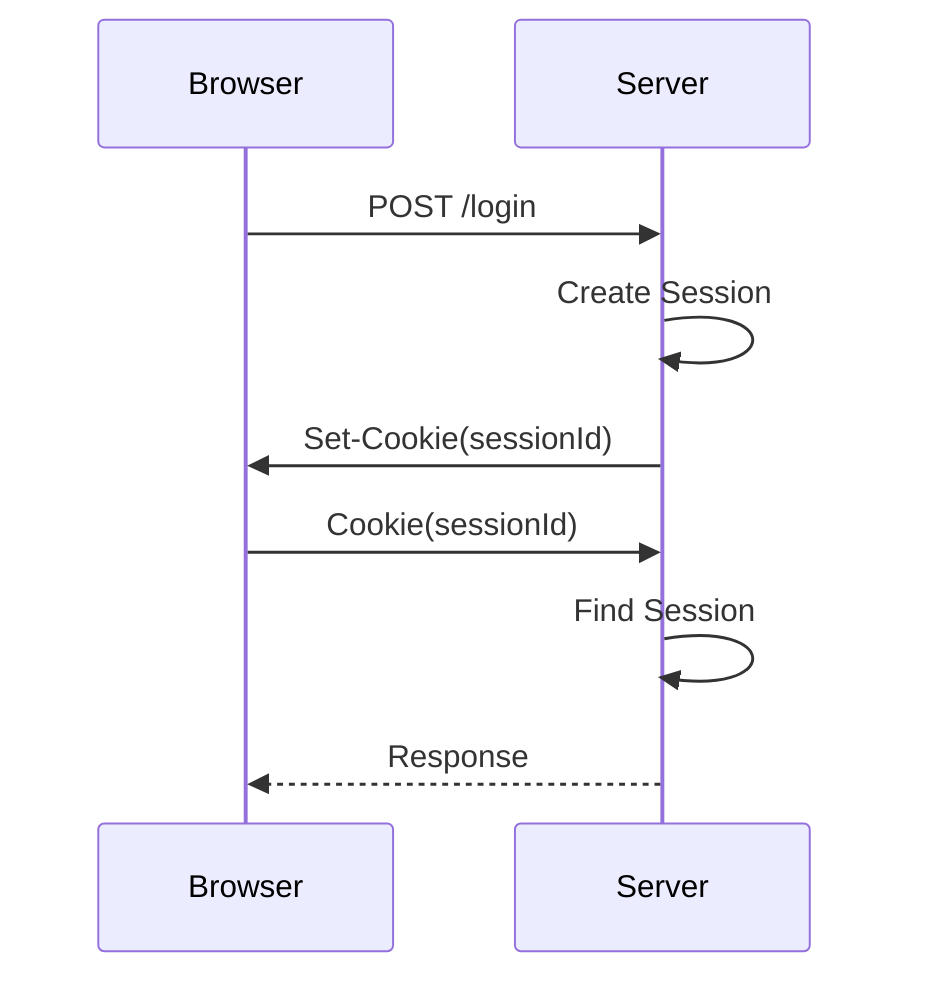
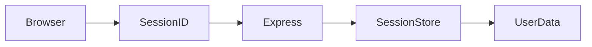
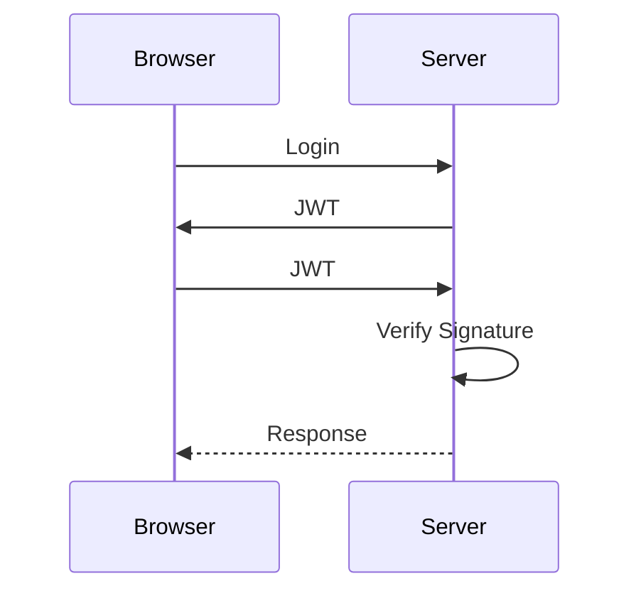
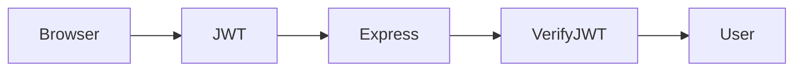

---

module: Module 2 - Web Communication & Browser Security Foundations
chapter: 03 - Stateful vs Stateless
day: Day 2
difficulty: Beginner
interview_importance: ⭐⭐⭐⭐⭐
status: Completed
last_revised:
hands_on: Yes
-------------

# Stateful vs Stateless

> **One of the most important concepts in Web Development and Web Security is understanding why HTTP is stateless and how applications remember users.**

---

# Learning Objectives

After completing this chapter, you should be able to:

* Understand what "State" means.
* Explain Stateful vs Stateless.
* Explain why HTTP is stateless.
* Understand why Sessions were invented.
* Understand why JWT was invented.
* Connect these concepts with your FitFlow application.

---

# What is State?

## Interview Definition

> **State is information remembered between multiple interactions.**

Simple example:

Imagine you walk into a coffee shop.

Day 1

```text
You:
One Coffee.
```

The cashier remembers you.

Day 2

```text
Cashier:

Welcome back Aditya!

Same Coffee?
```

The cashier remembered information.

That remembered information is called **State**.

---

# Stateful

A system is **Stateful** if it remembers previous interactions.

Example:

```text
Request 1

↓

Remember User

↓

Request 2

↓

Already knows User
```

---

# Stateless

A Stateless system remembers nothing.

Every request is treated as a completely new request.

Example

```text
Request 1

↓

Forget Everything

↓

Request 2

↓

Who are you?
```

---

# HTTP is Stateless

This is extremely important.

Imagine:

```http
POST /login
```

The server authenticates the user.

Request finishes.

Now the user sends

```http
GET /profile
```

Question:

How does the server know this is the same user?

Answer:

It doesn't.

HTTP forgot everything.

---

# Why is HTTP Stateless?

Because HTTP was designed to be:

* Simple
* Fast
* Scalable

If every server had to remember millions of users, memory usage would become enormous.

Instead,

every request must contain enough information for the server to process it.

---

# Problem Statement

Imagine Gmail.

Without remembering users:

```text
Request 1

POST /login

↓

Success

-------------------

Request 2

GET /inbox

↓

Who are you?

Please Login Again.
```

This would happen for every request.

Clearly impossible.

So developers invented ways to maintain state.

---

# Solution 1 — Server-side Sessions

Instead of remembering everything in HTTP,

the server stores user information in memory or a database.

The browser only stores a **Session ID**.

---



---

# Session Architecture



---

# Session Example

Browser stores

```text
sessionId=ABC123
```

Server stores

```text
ABC123

↓

Aditya

↓

Role

↓

Permissions

↓

Login Time
```

Notice

The browser only knows the Session ID.

The server knows everything else.

---

# Advantages of Sessions

* Easy to revoke.
* Easy logout.
* Sensitive data stays on the server.
* Good security.

---

# Disadvantages

* Server memory increases.
* Scaling becomes harder.
* Requires session storage.

---

# Solution 2 — JWT

Instead of storing user information on the server,

store it inside a signed token.

Browser stores the token.

Every request sends it.

Server verifies the signature.

---



---

# JWT Architecture



---

# Browser Stores

```text
JWT
```

Server stores

```text
Nothing
```

The token contains enough information to identify the user.

---

# Advantages of JWT

* Stateless
* Easy scaling
* No session store
* Great for APIs
* Microservices friendly

---

# Disadvantages

* Harder to revoke.
* Token theft is dangerous.
* Expiration must be handled carefully.

---

# Session vs JWT

| Feature             | Session    | JWT                           |
| ------------------- | ---------- | ----------------------------- |
| Server Stores State | ✅ Yes      | ❌ No                          |
| Browser Stores      | Session ID | JWT                           |
| Easy Logout         | ✅          | ⚠ Requires token invalidation |
| Easy Scaling        | ❌          | ✅                             |
| Server Memory       | High       | Low                           |

---

# Backend Restart

This interview question confused us during our discussion.

Suppose the backend restarts.

---

## Sessions

If sessions are stored only in server memory,

they disappear.

Users must login again.

---

## JWT

Browser still has the JWT.

After restart,

the server simply verifies the token again.

User stays logged in.

---

# FitFlow Example

Login

```text
POST /login

↓

Generate JWT

↓

Set-Cookie(accessToken)

↓

Browser stores Cookie

↓

GET /profile

↓

Browser automatically sends Cookie

↓

Express verifies JWT

↓

User Authenticated
```

Notice

The server does **not** remember previous requests.

The JWT carries the information.

---

# Security Perspective

An Application Security Engineer asks:

* Can this Session ID be guessed?
* Can the JWT be modified?
* Is the JWT signed?
* Does the Session expire?
* Is logout implemented correctly?
* Is the Cookie HttpOnly?

Authentication is never just about "logging in."

It is about maintaining identity securely across many HTTP requests.

---

# Common Mistakes

❌ HTTP remembers users.

No.

HTTP is Stateless.

---

❌ JWT stores user passwords.

Never.

Passwords should never be inside a JWT.

---

❌ Sessions are always better.

Not necessarily.

Choose based on architecture and requirements.

---

❌ JWT means the server stores nothing at all.

The server may still store refresh tokens, user records, or revoked tokens.

JWT simply removes the need for server-side session state.

---

# Interview Questions

## Q1

What is State?

Information remembered between multiple interactions.

---

## Q2

Is HTTP Stateful?

No.

HTTP is Stateless.

---

## Q3

Why were Sessions invented?

To maintain user identity across multiple HTTP requests.

---

## Q4

Why was JWT invented?

To provide a stateless authentication mechanism suitable for scalable applications and APIs.

---

## Q5

What happens if the backend restarts?

Sessions stored in memory are lost.

JWTs remain valid because the browser still sends the token and the server verifies it again.

---

# Revision Summary

✔ State = Remembering information.

✔ Stateful = Remembers previous requests.

✔ Stateless = Remembers nothing.

✔ HTTP is Stateless.

✔ Sessions store state on the server.

✔ JWT stores state inside the token.

✔ Sessions use Session IDs.

✔ JWT uses signed tokens.

✔ Browser remembers identity.

✔ Server verifies identity on every request.

---

# Hands-on Exercise

In your FitFlow backend:

1. Find the login controller.
2. Identify where the JWT is created.
3. Identify where `Set-Cookie` is called.
4. Find your `verifyJWT` middleware.
5. Trace the request from `/login` to `/profile`.

Draw the authentication flow yourself using a Mermaid diagram.
