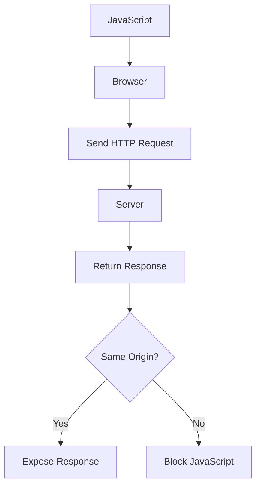

# 05 - Same-Origin Policy.md

---


# What is Same-Origin Policy?

**Definition**

> Same-Origin Policy (SOP) is a browser security policy that prevents JavaScript running on one origin from reading resources (responses) from another origin unless explicitly allowed.

One of the biggest misconceptions is:

❌ SOP blocks cross-origin requests.

This is **NOT** true.

The correct statement is:

✅ SOP allows cross-origin requests but prevents JavaScript from reading cross-origin responses.

---

# Why Does Same-Origin Policy Exist?

Imagine there was **no SOP**.

Suppose you're logged into:

```
https://bank.com
```

Then you visit:

```
https://evil.com
```

The attacker executes:

```javascript
fetch("https://bank.com/api/profile")
```

Without SOP:

```
evil.com
      │
      ▼
Reads Profile Data
      │
      ▼
Steals Personal Information
```

Your browser would expose:

- Bank Balance
- Profile
- Messages
- Emails
- Personal Information

to **evil.com**.

That would completely break the web.

SOP exists to prevent exactly this.

---

# What is an Origin?

An **Origin** is defined by three things.

```
Protocol
Host
Port
```

All three must match.

---

## Example

```
https://fitflow.com
```

Origin consists of

```
Protocol : https

Host     : fitflow.com

Port     : 443 (default HTTPS)
```

---

# Same Origin Examples

| URL 1 | URL 2 | Same Origin? | Reason |
|---------|--------|--------------|--------|
| https://fitflow.com | https://fitflow.com | ✅ | Same protocol, host, port |
| https://fitflow.com | http://fitflow.com | ❌ | Different protocol |
| https://fitflow.com | https://api.fitflow.com | ❌ | Different host |
| https://fitflow.com | https://fitflow.com:8080 | ❌ | Different port |
| http://localhost:5173 | http://localhost:5173 | ✅ | Everything matches |
| http://localhost:5173 | http://localhost:3737 | ❌ | Different port |

---

# Browser Decision

Whenever JavaScript tries to access another website, the browser asks:

```
Is it the same origin?
```

If

```
YES
```

Everything is allowed.

If

```
NO
```

Browser applies Same-Origin Policy.

---

# Browser Workflow

```mermaid
flowchart TD

A[JavaScript calls fetch()] --> B{Same Origin?}

B -->|Yes| C[Allow Reading Response]

B -->|No| D[Apply Same-Origin Policy]

D --> E[Request is still sent]

E --> F[Response arrives]

F --> G[Block JavaScript from reading response]
```

---

# Important

SOP does **NOT** stop the HTTP request.

Example

```javascript
fetch("https://google.com")
```

Browser still sends:

```
GET / HTTP/1.1
Host: google.com
```

The request reaches Google successfully.

Google replies.

The browser receives the response.

Only then does SOP say:

```
JavaScript cannot read this response.
```

---

# Example

Suppose

```
Current Website

https://evil.com
```

JavaScript executes

```javascript
fetch("https://bank.com/profile")
```

Browser Workflow

```
JavaScript

↓

Browser

↓

HTTP Request Sent

↓

bank.com

↓

Returns Response

↓

Browser

↓

Same-Origin Policy

↓

Block JavaScript
```

Notice:

The request was **never blocked**.

Only the response was protected.

---

# What SOP Protects

SOP protects sensitive information like

- User Profile
- Banking Information
- Email Messages
- API Responses
- Private JSON
- Personal Data

from being read by another website.

---

# Browser Decision Flow



---

# Common Misconception

Many developers believe

```
Cross-Origin Request

↓

Blocked
```

Wrong.

Correct flow

```
Cross-Origin Request

↓

Allowed

↓

Server Responds

↓

Browser Blocks Reading
```

---

# Does SOP Block Images?

Example

```html

```

Browser downloads the image.

SOP does **not** stop this.

However,

JavaScript running on another origin cannot freely access protected resources simply because the browser fetched them.

---

# Does SOP Block Forms?

Example

```html
<form action="https://bank.com/transfer" method="POST">
```

Browser submits the form.

SOP does **not** block the submission.

This is why CSRF attacks became possible.

---

# Does SOP Block fetch()?

No.

Example

```javascript
fetch("https://bank.com/profile")
```

Browser

✅ Sends request

Server

✅ Returns response

Browser

❌ Blocks JavaScript from reading response

---

# SOP vs CORS

Same-Origin Policy

```
Cross-Origin

↓

Request Sent

↓

Response Received

↓

Blocked
```

CORS

```
Cross-Origin

↓

Request Sent

↓

Server Says Allowed

↓

JavaScript Can Read Response
```

CORS is **not** a replacement for SOP.

CORS is a controlled exception to SOP.

---

# SOP vs CSRF

SOP

Protects

```
Reading Data
```

CSRF

Attempts to perform

```
Actions
```

Example

```
Transfer Money

Delete Account

Change Password
```

Even though SOP blocks reading,

CSRF can still succeed if proper protections (CSRF Tokens, SameSite) are missing.

---

# Real World Example

Current Website

```
https://evil.com
```

JavaScript

```javascript
fetch("https://bank.com/api/profile")
```

Browser

```
HTTP Request

✔ Sent
```

Server

```
200 OK
```

Browser

```
Response Received

↓

SOP

↓

Blocked
```

Console

```
TypeError

Failed to fetch

or

Blocked by Same-Origin Policy
```

---

# Interview Questions

## Does SOP block HTTP requests?

❌ No.

It only blocks JavaScript from reading cross-origin responses.

---

## Does SOP protect the server?

❌ No.

It protects the user's browser from exposing another website's data.

---

## Can HTML forms bypass SOP?

Yes.

Forms can submit cross-origin requests.

This is one reason CSRF attacks were possible before additional protections such as CSRF tokens and SameSite cookies.

---

## Does SOP stop Images?

No.

Images, stylesheets and some other resources may still be requested.

SOP mainly protects JavaScript's ability to access data from another origin.

---

# Common Mistakes

❌ SOP blocks requests.

✅ SOP blocks reading responses.

---

❌ SOP protects servers.

✅ SOP protects browsers.

---

❌ Cross-Origin means impossible.

✅ Cross-Origin means JavaScript cannot freely read responses unless CORS allows it.

---

# Quick Revision

## Definition

Browser security policy preventing JavaScript from reading cross-origin responses.

---

## Purpose

Prevent data theft between websites.

---

## Does it block requests?

❌ No

---

## Does it block reading responses?

✅ Yes

---

## Protects Against

- Reading API Responses
- Reading Sensitive JSON
- Reading User Data

---

## Does it stop CSRF?

❌ No

---

## Controlled Exception

CORS

---

# Cheat Sheet

```
SOP

↓

Request?
✔ Allowed

↓

Response?
✔ Received

↓

Read Response?

Same Origin → ✔

Cross Origin → ❌
```

---

# Key Takeaways

- SOP is enforced by the browser.
- SOP protects users, not servers.
- SOP does not stop HTTP requests.
- SOP prevents JavaScript from reading cross-origin responses.
- SOP is the foundation of browser security.
- CORS is a controlled exception to SOP.
- CSRF exists because browsers still allow cross-origin requests.
