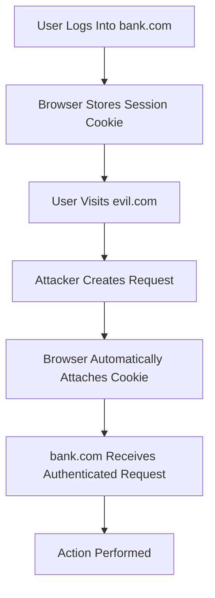
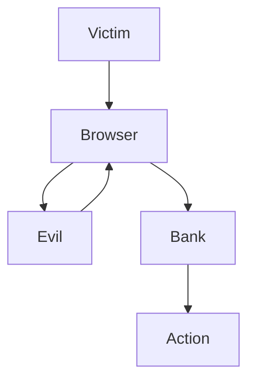
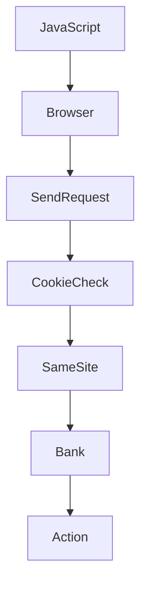

# 06 - CSRF.md

This is one of the most important chapters because we spent a lot of time understanding it conceptually. The notes below capture both the theory and the browser behavior.

---

# Cross-Site Request Forgery (CSRF)

---

# What is CSRF?

## Definition

> **Cross-Site Request Forgery (CSRF)** is an attack where an attacker tricks a victim's browser into sending an authenticated request to another website without the victim's intention.

Unlike XSS,

CSRF does **not** inject JavaScript into the target website.

Instead,

it abuses the browser's automatic cookie behavior.

---

# Why Does CSRF Exist?

The browser automatically attaches cookies belonging to a website.

Suppose you're logged into

```
https://bank.com
```

Browser stores

```
session=abc123
```

Later,

you visit

```
https://evil.com
```

If evil.com somehow makes your browser send a request to

```
https://bank.com
```

the browser automatically includes

```
Cookie:
session=abc123
```

because that cookie belongs to bank.com.

The attacker abuses this browser behavior.

---

# Browser Workflow



---

# Real Example

Victim logs into

```
https://bank.com
```

Browser stores

```
session=abc123
```

Attacker creates

```html
<form action="https://bank.com/transfer" method="POST">

<input
name="amount"
value="10000">

</form>

<script>
document.forms[0].submit();
</script>
```

Browser sends

```http
POST /transfer

Host: bank.com

Cookie:
session=abc123
```

Bank thinks

```
Authenticated User

↓

Transfer Money
```

---

# Why Does Bank Trust It?

Because the request contains

```
session=abc123
```

The bank cannot immediately distinguish whether

- the user intentionally clicked Transfer
- or another website caused the browser to send the request.

---

# Important

The attacker never steals the cookie.

The attacker never knows

```
abc123
```

The browser sends it automatically.

---

# Browser Decision

```
Request Going To

bank.com

↓

Any Cookie For bank.com?

↓

YES

↓

Attach Cookie
```

---

# Does SOP Stop CSRF?

No.

This is one of the biggest misconceptions.

SOP protects

```
Reading Responses
```

CSRF abuses

```
Sending Requests
```

These are different things.

---

# Why Doesn't HttpOnly Stop CSRF?

HttpOnly only prevents JavaScript from reading cookies.

Example

```javascript
document.cookie
```

Browser

```
HttpOnly

↓

No Cookie
```

However,

when making an HTTP request,

the browser still attaches the cookie automatically.

Therefore

```
HttpOnly

≠

CSRF Protection
```

---

# Why Doesn't Secure Stop CSRF?

Secure only means

```
Send Cookie

↓

HTTPS Only
```

It has nothing to do with

- fake requests
- CSRF
- attacker websites

---

# CSRF Attack Flow



---

# How Do We Prevent CSRF?

Modern applications use several layers.

---

# 1. SameSite Cookies

Cookie

```http
Set-Cookie:

session=abc123;

SameSite=Lax
```

Browser now checks

```
Cross-Site?

↓

Yes

↓

Should Cookie Be Sent?
```

Depending on SameSite,

browser may refuse.

---

# SameSite Modes

## Strict

```
Cross-Site

↓

Never Send Cookie
```

Highest security.

Poor user experience.

---

## Lax

```
Cross-Site

↓

Top-Level GET Navigation

↓

Send Cookie

Otherwise

↓

Don't Send
```

Default in modern browsers.

---

## None

```
Always Send Cookie
```

Must also use

```
Secure
```

Required for

- Shopify Embedded Apps
- OAuth
- Google Login
- Third-party authentication

---

# Top-Level Navigation

Top-Level Navigation means

```
Current Page

↓

Replaced By

↓

New Page
```

Examples

✔ Clicking Links

✔ Typing URL

✔ Bookmark

✔ Browser Back

Not Top-Level

❌ fetch()

❌ axios

❌ iframe

❌ img

❌ script

---

# CSRF Tokens

The strongest protection.

Server generates

```
Random Token
```

Example

```
3a91bc28
```

Stores it

```
Server Session
```

Also sends it to

the legitimate webpage.

Example

```html
<input
type="hidden"
name="_csrf"
value="3a91bc28">
```

When user submits

Browser sends

```http
POST /transfer

Cookie:
session=abc123

_csrf=3a91bc28
```

Server checks

```
Token Match?

↓

YES

↓

Process Request
```

Attacker cannot know

the token.

---

# Why Can't the Attacker Read the Token?

Because

```
evil.com

↓

Cannot Read

bank.com HTML
```

due to

```
Same-Origin Policy
```

Even though

browser sends requests,

evil.com cannot read

the page containing the CSRF token.

---

# CSRF Tokens in SPA

Traditional HTML

```
Hidden Input
```

React / Vue / Angular

Usually

```
Header

↓

X-CSRF-Token
```

Example

```javascript
fetch("/transfer", {

headers: {

"X-CSRF-Token":

token

}

})
```

---

# Difference Between CSRF and XSS

## CSRF

Attacker controls

```
evil.com
```

Victim remains authenticated.

Browser sends

authenticated request.

No JavaScript is injected into bank.com.

---

## XSS

Attacker injects JavaScript

inside

```
bank.com
```

Victim only visits

```
bank.com
```

The malicious script is delivered

by

```
bank.com
```

itself.

---

# Browser Decision Flow



---

# Common Misconceptions

❌ CSRF steals cookies.

✅ Browser sends cookies automatically.

---

❌ HttpOnly prevents CSRF.

✅ HttpOnly only blocks JavaScript from reading cookies.

---

❌ SOP prevents CSRF.

✅ SOP only blocks reading responses.

---

❌ CSRF requires JavaScript.

✅ HTML Forms alone are enough.

---

# Interview Questions

## What is CSRF?

Cross-Site Request Forgery is an attack where an attacker tricks a victim's browser into sending an authenticated request to another website.

---

## Why is CSRF possible?

Because browsers automatically attach cookies.

---

## Does CSRF steal cookies?

No.

The browser simply includes them automatically.

---

## Does SOP stop CSRF?

No.

---

## Does HttpOnly stop CSRF?

No.

---

## Best Protection?

- CSRF Tokens
- SameSite Cookies
- Checking Origin / Referer (additional layer)

---

# Quick Revision

## Goal

Perform unauthorized actions.

---

## Exploits

Automatic Cookie Sending.

---

## Main Protection

CSRF Token

---

## Browser Automatically

✔ Sends Cookie

---

## Browser Does NOT

Verify user intention.

---

# Cheat Sheet

```
Victim Logs In

↓

Cookie Stored

↓

Victim Visits evil.com

↓

evil.com Creates Request

↓

Browser Sends Cookie

↓

Server Executes Action
```

---

# Key Takeaways

- CSRF exploits browser behavior, not stolen cookies.
- The browser automatically attaches cookies to matching domains.
- SOP does not prevent CSRF because it protects reading responses, not sending requests.
- HttpOnly protects cookies from JavaScript but does not stop CSRF.
- SameSite cookies reduce CSRF risk by controlling when cookies are sent.
- CSRF tokens are the strongest defense because attackers cannot obtain the secret token from another origin.
- XSS and CSRF are different attacks: XSS injects JavaScript into the target site, while CSRF tricks the browser into sending authenticated requests.


---
