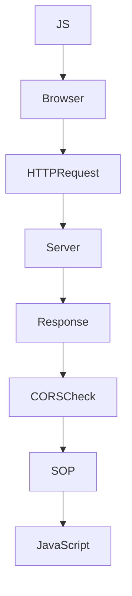

# Cross-Origin Resource Sharing (CORS)

---

# What is CORS?

## Definition

> **Cross-Origin Resource Sharing (CORS)** is a browser security mechanism that allows a server to tell the browser which origins are permitted to read cross-origin responses.

One of the biggest misconceptions is

❌ CORS allows cross-origin requests.

This is **NOT** true.

The correct definition is

✅ CORS allows JavaScript to read cross-origin responses **only if the server explicitly allows it.**

---

# Why Does CORS Exist?

Remember Same-Origin Policy.

Suppose

Frontend

```
https://app.fitflow.com
```

Backend

```
https://api.fitflow.com
```

These are

```
Different Origins
```

Without CORS

```
React

↓

fetch()

↓

Browser

↓

HTTP Request Sent

↓

Server Responds

↓

Browser Blocks JavaScript
```

Oops...

You own both websites.

The browser doesn't know that.

CORS allows the server to tell the browser

```
I trust this origin.
```

---

# Browser Workflow

```mermaid
flowchart TD

A[JavaScript calls fetch()] --> B[Browser]

B --> C[Send HTTP Request]

C --> D[Server]

D --> E[Return Response]

E --> F{Access-Control-Allow-Origin?}

F -->|Allowed| G[Expose Response]

F -->|Not Allowed| H[Block JavaScript]
```

---

# Browser Security Decision

Notice

```
HTTP Request

↓

Always Sent

↓

Response

↓

Received

↓

Browser Checks CORS

↓

Allow Reading?
```

CORS does **NOT** stop requests.

It controls

```
Reading Responses
```

---

# Browser Automatically Sends Origin

Suppose

Current Website

```
https://fitflow.com
```

JavaScript

```javascript
fetch("https://api.fitflow.com/profile")
```

Browser automatically adds

```http
GET /profile

Origin:

https://fitflow.com
```

You never wrote

```javascript
headers:{

Origin:"..."
}
```

The browser creates it.

---

# Why?

The server must know

```
Who Is Asking?
```

Without Origin

the server cannot make a CORS decision.

---

# Can JavaScript Modify Origin?

No.

Example

```javascript
fetch("/profile",{

headers:{

Origin:

"https://evil.com"

}

})
```

Browser ignores it.

Actual Request

```http
Origin:

https://fitflow.com
```

Origin is controlled by

```
Browser
```

not

```
JavaScript
```

---

# Server Response

Server decides

who is trusted.

Example

```http
Access-Control-Allow-Origin:

https://fitflow.com
```

Meaning

```
JavaScript

Running On

https://fitflow.com

↓

May Read My Response
```

---

# Browser Decision

Request Origin

```
https://fitflow.com
```

Server Response

```
Access-Control-Allow-Origin:

https://fitflow.com
```

Browser

```
Match

↓

Expose Response
```

---

# What Happens Without CORS?

Browser

```
Request

✔ Sent

↓

Response

✔ Received

↓

Access-Control-Allow-Origin

Missing

↓

Block JavaScript
```

Server still executed everything.

---

# Biggest Misconception

Developers think

```
CORS Error

↓

Backend Didn't Receive Request
```

Wrong.

Backend did receive

the request.

Backend did execute it.

Browser simply refused

to expose

the response.

---

# Origin vs Access-Control-Allow-Origin

## Origin

Created by

```
Browser
```

Sent in

```
Request
```

Example

```http
Origin:

https://fitflow.com
```

---

## Access-Control-Allow-Origin

Created by

```
Server
```

Sent in

```
Response
```

Example

```http
Access-Control-Allow-Origin:

https://fitflow.com
```

---

# Browser Conversation

Browser

```
Origin:

https://fitflow.com
```

Server

```
Access-Control-Allow-Origin:

https://fitflow.com
```

Browser

```
They Match

↓

JavaScript May Read Response
```

---

# Simple Requests

Not every request requires

Preflight.

Simple Requests include

Methods

```
GET

HEAD

POST
```

with simple headers and simple content types.

Example

```javascript
fetch("/users")
```

Browser

```
GET /users
```

No OPTIONS.

---

# Preflight Requests

Suppose

```javascript
fetch("/users",{

method:"DELETE"

})
```

Browser thinks

```
DELETE?

↓

Potentially Dangerous

↓

Ask Server First
```

Browser sends

```http
OPTIONS /users
```

Meaning

```
If I later send

DELETE

will you allow it?
```

---

# Why Preflight Exists

Imagine

Browser immediately sends

```
DELETE /account
```

Then checks CORS.

Too late.

The account is already deleted.

Instead

```
OPTIONS

↓

Permission Check

↓

DELETE
```

---

# Requests That Trigger Preflight

DELETE

PUT

PATCH

POST with

```
application/json
```

Custom Headers

Example

```
X-CSRF-Token

Authorization

X-API-Key
```

---

# Requests That Do NOT Trigger Preflight

GET

HEAD

Traditional HTML Forms

```
application/x-www-form-urlencoded

multipart/form-data

text/plain
```

---

# Example

React

```javascript
fetch("/login",{

method:"POST",

headers:{

Content-Type:

"application/json"

}

})
```

Browser

```
OPTIONS

↓

POST
```

---

Traditional HTML

```html
<form method="POST">
```

Browser

```
POST
```

No OPTIONS.

---

# Credentials

Example

```javascript
fetch("/profile",{

credentials:"include"

})
```

Browser

```
Attach Cookies
```

if available.

---

# Access-Control-Allow-Credentials

Server

```http
Access-Control-Allow-Credentials:

true
```

Meaning

```
Browser

You May Send Cookies
```

---

# Wildcard Rule

This is invalid

```http
Access-Control-Allow-Origin: *

Access-Control-Allow-Credentials:true
```

Browser rejects it.

Reason

Wildcard means

```
Everyone
```

Credentials mean

```
Authenticated User
```

Browser refuses

to expose

authenticated data

to everyone.

---

# Correct Configuration

```http
Origin:

https://fitflow.com
```

Server

```http
Access-Control-Allow-Origin:

https://fitflow.com

Access-Control-Allow-Credentials:

true
```

Browser

```
Origin Matches

↓

Allow Response
```

---

# Postman vs Browser

Browser

```
Implements

SOP

CORS

SameSite

CSP
```

Postman

```
Simple HTTP Client
```

No SOP.

No CORS.

No Browser Security.

---

Example

Browser

```
CORS Error
```

Postman

```
200 OK
```

Backend is fine.

Browser blocks

the response.

---

# Does CORS Protect Servers?

No.

CORS protects

```
Browser
```

not

```
Server
```

---

Python Example

```python
import requests

requests.get("https://api.fitflow.com")
```

Python ignores

```
Access-Control-Allow-Origin
```

because

Python is

not

a browser.

---

# Browser Security Pipeline



---

# Common Misconceptions

❌ CORS blocks requests.

✅ Browser sends requests.

---

❌ CORS protects APIs.

✅ CORS protects browsers.

---

❌ Postman obeys CORS.

✅ Postman ignores CORS.

---

❌ JavaScript can modify Origin.

✅ Browser controls Origin.

---

❌ CORS and SOP are different systems.

✅ CORS is a controlled exception to SOP.

---

# Interview Questions

## What is CORS?

A browser security mechanism allowing servers to specify which origins may read cross-origin responses.

---

## Does CORS stop HTTP requests?

No.

---

## Who creates Origin?

Browser.

---

## Who creates Access-Control-Allow-Origin?

Server.

---

## Why OPTIONS?

Permission check before potentially dangerous requests.

---

## Why does Postman work but Browser doesn't?

Because browsers enforce CORS.

Postman doesn't.

---

## Can JavaScript change Origin?

No.

---

## Does CORS protect servers?

No.

It protects browsers.

---

# Quick Revision

Definition

Browser security mechanism controlling

```
Who Can Read

Cross-Origin Responses
```

---

Origin

Browser

↓

Request

---

Access-Control-Allow-Origin

Server

↓

Response

---

OPTIONS

Permission Check.

---

Browser Sends Request?

✅ Yes

---

Browser Reads Response?

Depends on CORS.

---

# Cheat Sheet

```
JavaScript

↓

Browser

↓

Request

↓

Origin Header

↓

Server

↓

Access-Control-Allow-Origin

↓

Browser

↓

Expose Response?

↓

YES / NO
```

---

# Key Takeaways

- CORS is enforced by browsers.
- Requests are usually sent regardless of CORS.
- The browser automatically adds the `Origin` header.
- JavaScript cannot modify the `Origin` header.
- The server decides trusted origins using `Access-Control-Allow-Origin`.
- Preflight (`OPTIONS`) is a permission check before certain cross-origin requests.
- `Access-Control-Allow-Origin: *` cannot be combined with `Access-Control-Allow-Credentials: true`.
- Postman, curl, and Python ignore CORS because they are not browsers.
- CORS protects users' browsers, not backend servers.

---
